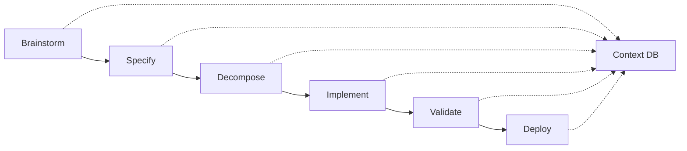

# Nexus Workflow

[](LICENSE)
[](https://nodejs.org)
[](https://www.typescriptlang.org)
[](#testing)

A quality-first workflow system with constitutional TDD enforcement and adaptive questioning. Nexus provides a structured approach to software development through a 6-phase pipeline that ensures quality, clarity, and maintainability.

## 🌟 Key Features

- **Constitutional TDD Enforcement**: Immutable principles ensuring test-first development
- **6-Phase Workflow Pipeline**: Brainstorm → Specify → Decompose → Implement → Validate → Deploy
- **Adaptive Questioning Engine**: Intelligent clarification system for ambiguity resolution
- **Progressive Context Embedding**: Smart context management throughout the workflow
- **Specialized Agent Architecture**: Role-based agents with hard boundaries
- **SQLite-Based State Management**: Persistent workflow state and progress tracking
- **Quality Gates**: Automated validation at each phase transition
- **Interactive CLI**: User-friendly command-line interface with rich feedback

## 🏗️ Architecture Overview

### Constitutional Framework

Nexus operates under 5 immutable principles that cannot be overridden:

1. **Test-Driven Development**: All code must be preceded by failing tests
2. **Question Everything, Assume Nothing**: Ambiguities must be resolved before proceeding
3. **Context Preservation**: All decisions and context must be maintained
4. **Interactive Validation**: Human validation required at critical decision points
5. **Quality Gates**: Automated quality checks at every phase transition

### Workflow Pipeline



Each phase has specific responsibilities:

- **Brainstorm**: Adaptive questioning to understand requirements
- **Specify**: Generate detailed technical specifications
- **Decompose**: Break specifications into atomic, testable tasks
- **Implement**: TDD-enforced implementation with continuous validation
- **Validate**: Comprehensive quality assurance and testing
- **Deploy**: Controlled deployment with rollback capabilities

## 🚀 Quick Start

### Prerequisites

- Node.js ≥ 20.0.0
- npm or yarn
- Git

### Installation

```bash
# Clone the repository
git clone https://github.com/your-username/nexus-workflow.git
cd nexus-workflow

# Install dependencies
npm install

# Build the project
npm run build

# Run tests to verify installation
npm test
```

### Initialize a New Project

```bash
# Initialize Nexus in current directory
npx nexus init

# Initialize with specific project name
npx nexus init --name "my-project"

# Initialize in specific directory
npx nexus init --dir "./my-project"

# Force reinitialization (caution: overwrites existing .nexus)
npx nexus init --force
```

### Basic Workflow

```bash
# 1. Start with brainstorming
npx nexus brainstorm --output brainstorm.md

# 2. Generate specifications
npx nexus specify --input brainstorm.md --output spec.md

# 3. Decompose into tasks
npx nexus decompose --input spec.md --output ./tasks

# 4. Implement with TDD enforcement
npx nexus implement --task ./tasks/task-001.md

# 5. Validate and deploy (commands coming soon)
npx nexus validate
npx nexus deploy
```

## 📚 Commands

### `nexus init`

Initialize a new Nexus workflow project.

**Options:**
- `-n, --name <name>`: Project name
- `-d, --dir <directory>`: Project directory (default: current directory)
- `-f, --force`: Force reinitialization if .nexus exists
- `--skip-tdd`: Skip TDD commitment (not recommended)

**Example:**
```bash
npx nexus init --name "my-app" --dir "./projects/my-app"
```

### `nexus brainstorm`

Start an adaptive brainstorming session with intelligent questioning.

**Options:**
- `-c, --context <file>`: Context file path
- `-o, --output <file>`: Output file path (default: brainstorm.md)

**Example:**
```bash
npx nexus brainstorm --context requirements.txt --output initial-brainstorm.md
```

### `nexus specify`

Generate detailed technical specifications from brainstorm output.

**Options:**
- `-i, --input <file>`: Brainstorm input file (default: brainstorm.md)
- `-o, --output <file>`: Specification output file (default: specification.md)

**Example:**
```bash
npx nexus specify --input brainstorm.md --output detailed-spec.md
```

### `nexus decompose`

Decompose specifications into atomic, implementable tasks.

**Options:**
- `-i, --input <file>`: Specification input file (default: specification.md)
- `-o, --output <directory>`: Output directory for task files (default: current directory)

**Example:**
```bash
npx nexus decompose --input spec.md --output ./tasks
```

### `nexus implement`

Implement tasks with constitutional TDD enforcement.

**Options:**
- `-t, --task <file>`: Task file to implement
- `--no-tdd`: Disable TDD enforcement (not recommended, violates constitution)

**Example:**
```bash
npx nexus implement --task ./tasks/authentication-task.md
```

## 🧪 Testing

Nexus enforces a minimum 80% test coverage and follows strict TDD principles.

```bash
# Run all tests
npm test

# Run tests in watch mode
npm run test:watch

# Generate coverage report
npm run test:coverage

# Run linting
npm run lint

# Type checking
npm run typecheck
```

### Test Structure

```
tests/
├── unit/           # Unit tests for individual components
├── integration/    # Integration tests for workflows
└── e2e/           # End-to-end tests for full pipeline
```

## 🏗️ Project Structure

```
nexus-workflow/
├── src/
│   ├── agents/           # Specialized workflow agents
│   ├── commands/         # CLI command implementations
│   ├── core/            # Core system components
│   │   ├── context/     # Context management
│   │   ├── database/    # SQLite database layer
│   │   └── questions/   # Adaptive questioning engine
│   ├── orchestration/   # Workflow orchestration
│   ├── templates/       # Templates and schemas
│   ├── types/          # TypeScript type definitions
│   └── utils/          # Utility functions
├── docs/               # Documentation
├── templates/          # Project templates
├── tests/             # Test suites
└── .nexus/           # Nexus configuration (created by init)
```

## 🔧 Configuration

Nexus creates a `.nexus/` directory in your project root containing:

```
.nexus/
├── config.yaml         # Main configuration
├── constitution.yaml   # Constitutional principles (immutable)
├── database.sqlite     # Workflow state database
├── context/           # Context preservation
└── templates/         # Custom templates
```

### Configuration Options

Key configuration options in `.nexus/config.yaml`:

```yaml
# Constitutional settings (cannot be modified)
constitution:
  tdd_enforcement: true
  quality_gates: true
  context_preservation: true

# Workflow settings
workflow:
  default_phase: "brainstorm"
  auto_save: true
  confirmation_required: true

# Agent settings
agents:
  timeout: 300
  parallel_limit: 3

# Quality settings
quality:
  min_coverage: 80
  complexity_threshold: 10
  lint_enforcement: true
```

## 🤝 Contributing

We welcome contributions! Please see our [Contributing Guide](CONTRIBUTING.md) for details.

### Development Setup

```bash
# Clone and install
git clone https://github.com/your-username/nexus-workflow.git
cd nexus-workflow
npm install

# Start development mode
npm run dev

# Run tests continuously
npm run test:watch
```

### Code Standards

- **TDD Required**: All new features must be test-driven
- **TypeScript Strict Mode**: Full type safety enforced
- **ESLint + Prettier**: Code formatting and linting
- **Conventional Commits**: Semantic commit messages
- **80% Coverage Minimum**: Maintained through automated checks

## 📖 Documentation

- [Architecture Guide](docs/architecture.md) - Detailed system architecture
- [API Reference](docs/api.md) - Complete API documentation
- [User Guide](docs/user-guide.md) - Comprehensive usage guide
- [Contributing Guide](CONTRIBUTING.md) - Development guidelines
- [Changelog](CHANGELOG.md) - Version history and changes

## 🆘 Troubleshooting

### Common Issues

**Q: Nexus init fails with permission errors**
A: Ensure you have write permissions in the target directory.

**Q: TDD enforcement is too strict**
A: This is by design. The constitutional framework cannot be bypassed. Consider breaking your work into smaller, testable units.

**Q: Database corruption after system crash**
A: Nexus includes automatic database recovery. Run `nexus init --force` to reinitialize if needed.

**Q: Context seems to be lost between phases**
A: Check `.nexus/context/` directory. Context preservation is constitutional and should never fail.

### Getting Help

- **Issues**: [GitHub Issues](https://github.com/your-username/nexus-workflow/issues)
- **Discussions**: [GitHub Discussions](https://github.com/your-username/nexus-workflow/discussions)
- **Wiki**: [Project Wiki](https://github.com/your-username/nexus-workflow/wiki)

## 📄 License

MIT License - see [LICENSE](LICENSE) file for details.

## 🙏 Acknowledgments

- Inspired by constitutional AI principles and test-driven development practices
- Built with modern TypeScript and Node.js ecosystem
- Designed for developer productivity and code quality

---

**Status**: ✅ Active Development | **Version**: 0.1.0 | **Node**: ≥20.0.0

Made with ❤️ for developers who value quality and clarity.