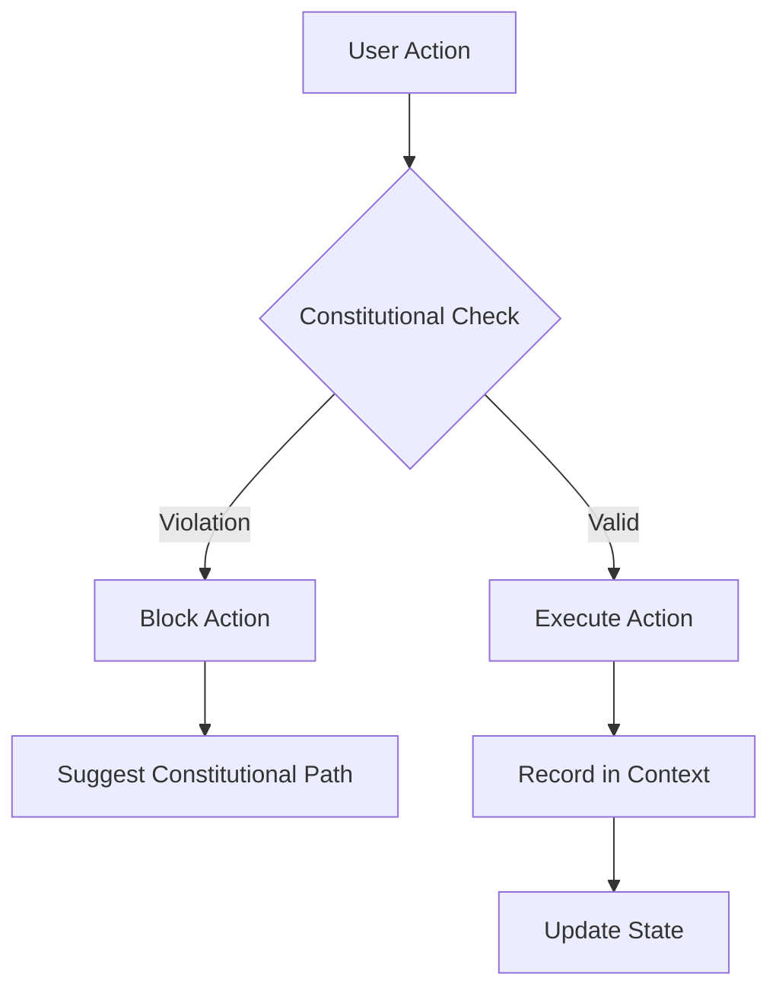
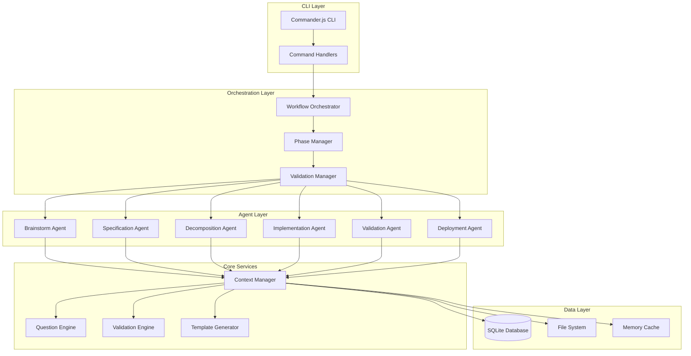
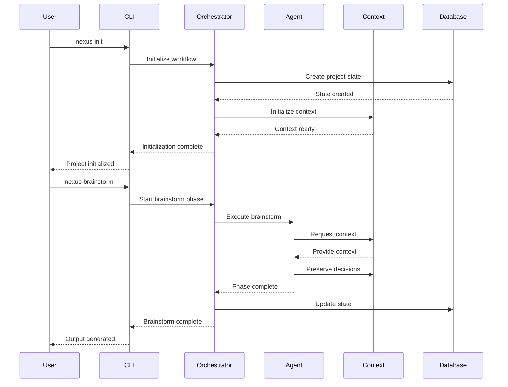

# Nexus Workflow Architecture

This document provides a comprehensive overview of the Nexus Workflow system architecture, design patterns, and implementation details.

## Table of Contents

- [Overview](#overview)
- [Constitutional Framework](#constitutional-framework)
- [System Architecture](#system-architecture)
- [Component Design](#component-design)
- [Data Flow](#data-flow)
- [Database Schema](#database-schema)
- [Agent Architecture](#agent-architecture)
- [Context Management](#context-management)
- [Quality Systems](#quality-systems)
- [Extension Points](#extension-points)

## Overview

Nexus Workflow is built on a constitutional foundation that enforces immutable principles for software development quality. The system uses a 6-phase pipeline with specialized agents, progressive context embedding, and comprehensive validation systems.

### Core Principles

1. **Constitutional Immutability**: Core principles cannot be overridden or bypassed
2. **Test-Driven Everything**: All code must be preceded by failing tests
3. **Context Preservation**: Complete audit trail of all decisions and changes
4. **Interactive Validation**: Human oversight at critical decision points
5. **Quality Gates**: Automated validation prevents phase transitions without quality compliance

## Constitutional Framework

### Architecture Pattern: Constitutional Governance

```typescript
interface Constitution {
  version: string;
  ratified: Date;
  status: 'DEFINITIVE' | 'DRAFT' | 'DEPRECATED';
  immutable_principles: ImmutablePrinciple[];
  enforcement_mechanisms: EnforcementRule[];
}

interface ImmutablePrinciple {
  id: string;
  title: string;
  rules: string[];
  validation_criteria: ValidationCriteria;
  violation_consequences: ViolationResponse[];
}
```

The constitutional framework ensures that:
- TDD enforcement cannot be disabled without explicit constitutional amendment
- Quality gates are mandatory and cannot be bypassed
- Context preservation is guaranteed at the architectural level
- Interactive validation points are constitutionally protected

### Enforcement Mechanisms



## System Architecture

### High-Level Architecture



### Layer Responsibilities

#### CLI Layer
- **Commander.js CLI**: Entry point, argument parsing, help system
- **Command Handlers**: Implement individual CLI commands with validation

#### Orchestration Layer
- **Workflow Orchestrator**: Manages the 6-phase pipeline execution
- **Phase Manager**: Controls phase transitions and state management
- **Validation Manager**: Enforces constitutional compliance and quality gates

#### Agent Layer
- **Specialized Agents**: Each phase has dedicated agents with role boundaries
- **Agent Communication**: Structured handoffs between phases
- **Context Isolation**: Agents operate within defined scopes

#### Core Services
- **Context Manager**: Progressive context embedding and preservation
- **Question Engine**: Adaptive questioning for ambiguity resolution
- **Validation Engine**: Quality gates and constitutional enforcement
- **Template Generator**: Dynamic template generation and customization

#### Data Layer
- **SQLite Database**: Persistent workflow state and audit trail
- **File System**: Templates, configurations, and generated artifacts
- **Memory Cache**: Performance optimization for frequently accessed data

## Component Design

### Command Handler Pattern

All CLI commands follow a consistent handler pattern:

```typescript
abstract class CommandHandler {
  protected config: CommandConfig;
  protected contextManager: IContextManager;
  protected database: DatabaseManager;

  abstract execute(): Promise<CommandResult>;

  protected validateConstitution(): Promise<ValidationResult>;
  protected preserveContext(): Promise<void>;
  protected enforceQualityGates(): Promise<QualityResult>;
}
```

### Agent Architecture Pattern

```typescript
interface IWorkflowAgent {
  phase: WorkflowPhase;
  capabilities: AgentCapability[];
  dependencies: AgentDependency[];

  execute(context: PhaseContext): Promise<PhaseResult>;
  validate(input: PhaseInput): Promise<ValidationResult>;
  handoff(nextAgent: IWorkflowAgent): Promise<HandoffResult>;
}

abstract class WorkflowAgent implements IWorkflowAgent {
  protected readonly constitutionalRules: ConstitutionalRule[];
  protected readonly qualityGates: QualityGate[];

  // Template method pattern for phase execution
  public async execute(context: PhaseContext): Promise<PhaseResult> {
    await this.validateConstitution(context);
    await this.enforceQualityGates(context);
    const result = await this.executePhase(context);
    await this.preserveContext(result);
    return result;
  }

  protected abstract executePhase(context: PhaseContext): Promise<PhaseResult>;
}
```

### Context Management Pattern

Progressive context embedding ensures that each phase has access to all relevant information from previous phases:

```typescript
interface IContextManager {
  // Context operations
  embedContext(phase: WorkflowPhase, data: ContextData): Promise<void>;
  retrieveContext(phase: WorkflowPhase): Promise<ContextData>;
  preserveDecision(decision: Decision): Promise<void>;

  // Progressive embedding
  buildPhaseContext(targetPhase: WorkflowPhase): Promise<PhaseContext>;
  linkContextElements(source: ContextElement, target: ContextElement): Promise<void>;

  // Audit trail
  getDecisionTrail(fromPhase?: WorkflowPhase): Promise<Decision[]>;
  validateContextIntegrity(): Promise<ValidationResult>;
}
```

## Data Flow

### Workflow Data Flow



### Context Flow

```mermaid
graph LR
    subgraph "Phase 1: Brainstorm"
        B1[User Requirements]
        B2[Clarifying Questions]
        B3[Context Embedding]
    end

    subgraph "Phase 2: Specify"
        S1[Technical Specs]
        S2[Architecture Decisions]
        S3[Context Enhancement]
    end

    subgraph "Phase 3: Decompose"
        D1[Task Breakdown]
        D2[Dependency Analysis]
        D3[Context Refinement]
    end

    B3 --> S1
    S3 --> D1
    D3 --> Implementation

    B1 --> B2 --> B3
    S1 --> S2 --> S3
    D1 --> D2 --> D3
```



## Database Schema

### Core Tables

```sql
-- Workflow state management
CREATE TABLE workflows (
    id TEXT PRIMARY KEY,
    name TEXT NOT NULL,
    current_phase TEXT NOT NULL,
    status TEXT NOT NULL,
    created_at DATETIME DEFAULT CURRENT_TIMESTAMP,
    updated_at DATETIME DEFAULT CURRENT_TIMESTAMP
);

-- Phase execution tracking
CREATE TABLE phase_executions (
    id TEXT PRIMARY KEY,
    workflow_id TEXT NOT NULL,
    phase TEXT NOT NULL,
    status TEXT NOT NULL,
    start_time DATETIME DEFAULT CURRENT_TIMESTAMP,
    end_time DATETIME,
    input_context TEXT,
    output_context TEXT,
    validation_results TEXT,
    FOREIGN KEY (workflow_id) REFERENCES workflows(id)
);

-- Context preservation
CREATE TABLE context_elements (
    id TEXT PRIMARY KEY,
    workflow_id TEXT NOT NULL,
    phase TEXT NOT NULL,
    element_type TEXT NOT NULL,
    content TEXT NOT NULL,
    metadata TEXT,
    created_at DATETIME DEFAULT CURRENT_TIMESTAMP,
    FOREIGN KEY (workflow_id) REFERENCES workflows(id)
);

-- Decision audit trail
CREATE TABLE decisions (
    id TEXT PRIMARY KEY,
    workflow_id TEXT NOT NULL,
    phase TEXT NOT NULL,
    decision_type TEXT NOT NULL,
    description TEXT NOT NULL,
    rationale TEXT,
    alternatives_considered TEXT,
    decision_maker TEXT,
    timestamp DATETIME DEFAULT CURRENT_TIMESTAMP,
    FOREIGN KEY (workflow_id) REFERENCES workflows(id)
);

-- Constitutional compliance tracking
CREATE TABLE constitutional_validations (
    id TEXT PRIMARY KEY,
    workflow_id TEXT NOT NULL,
    phase TEXT NOT NULL,
    principle_id TEXT NOT NULL,
    validation_result TEXT NOT NULL,
    details TEXT,
    timestamp DATETIME DEFAULT CURRENT_TIMESTAMP,
    FOREIGN KEY (workflow_id) REFERENCES workflows(id)
);

-- Quality gates tracking
CREATE TABLE quality_gate_results (
    id TEXT PRIMARY KEY,
    workflow_id TEXT NOT NULL,
    phase TEXT NOT NULL,
    gate_name TEXT NOT NULL,
    status TEXT NOT NULL,
    score REAL,
    details TEXT,
    timestamp DATETIME DEFAULT CURRENT_TIMESTAMP,
    FOREIGN KEY (workflow_id) REFERENCES workflows(id)
);
```

### Indexing Strategy

```sql
-- Performance indexes
CREATE INDEX idx_workflows_status ON workflows(status);
CREATE INDEX idx_phase_executions_workflow_phase ON phase_executions(workflow_id, phase);
CREATE INDEX idx_context_elements_workflow_phase ON context_elements(workflow_id, phase);
CREATE INDEX idx_decisions_workflow_phase ON decisions(workflow_id, phase);
CREATE INDEX idx_constitutional_validations_workflow ON constitutional_validations(workflow_id);
CREATE INDEX idx_quality_gate_results_workflow ON quality_gate_results(workflow_id);

-- Audit trail indexes
CREATE INDEX idx_decisions_timestamp ON decisions(timestamp);
CREATE INDEX idx_constitutional_validations_timestamp ON constitutional_validations(timestamp);
CREATE INDEX idx_quality_gate_results_timestamp ON quality_gate_results(timestamp);
```

## Agent Architecture

### Specialized Agent Design

Each workflow phase has a dedicated agent with specific capabilities:

#### Brainstorm Agent
```typescript
class BrainstormAgent extends WorkflowAgent {
  phase = WorkflowPhase.BRAINSTORM;

  capabilities = [
    AgentCapability.ADAPTIVE_QUESTIONING,
    AgentCapability.REQUIREMENT_ELICITATION,
    AgentCapability.AMBIGUITY_DETECTION
  ];

  protected async executePhase(context: PhaseContext): Promise<PhaseResult> {
    // Adaptive questioning implementation
    const questions = await this.generateQuestions(context);
    const answers = await this.collectAnswers(questions);
    const requirements = await this.synthesizeRequirements(answers);

    return {
      requirements,
      clarifications: answers,
      nextPhaseContext: this.buildNextPhaseContext(requirements)
    };
  }
}
```

#### Implementation Agent
```typescript
class ImplementationAgent extends WorkflowAgent {
  phase = WorkflowPhase.IMPLEMENT;

  capabilities = [
    AgentCapability.TDD_ENFORCEMENT,
    AgentCapability.CODE_GENERATION,
    AgentCapability.TEST_CREATION
  ];

  protected async executePhase(context: PhaseContext): Promise<PhaseResult> {
    // Constitutional TDD enforcement
    await this.enforceTDD(context);

    const tasks = context.decomposedTasks;
    const results = [];

    for (const task of tasks) {
      const testResult = await this.createFailingTest(task);
      const implementation = await this.implementFeature(task, testResult);
      const validation = await this.validateImplementation(implementation);

      results.push({ task, testResult, implementation, validation });
    }

    return { implementations: results };
  }

  private async enforceTDD(context: PhaseContext): Promise<void> {
    const constitution = await this.getConstitution();
    const tddPrinciple = constitution.principles.find(p => p.id === 'TDD');

    if (!tddPrinciple.isEnforced) {
      throw new ConstitutionalViolationError('TDD enforcement is constitutionally required');
    }
  }
}
```

### Agent Communication Protocol

```typescript
interface AgentHandoff {
  fromAgent: IWorkflowAgent;
  toAgent: IWorkflowAgent;
  context: PhaseContext;
  validations: ValidationResult[];
  timestamp: Date;
}

interface HandoffProtocol {
  validateReadiness(toAgent: IWorkflowAgent, context: PhaseContext): Promise<boolean>;
  transferContext(handoff: AgentHandoff): Promise<void>;
  verifyIntegrity(context: PhaseContext): Promise<ValidationResult>;
}
```

## Context Management

### Progressive Context Embedding

Context management follows a progressive embedding pattern where each phase builds upon previous context while adding its own contributions:

```typescript
class ContextManager implements IContextManager {
  // Core context structure
  private contextLayers: Map<WorkflowPhase, ContextLayer> = new Map();

  async buildPhaseContext(targetPhase: WorkflowPhase): Promise<PhaseContext> {
    const context = new PhaseContext(targetPhase);

    // Add constitutional context (always present)
    context.addLayer(await this.getConstitutionalContext());

    // Add preceding phase contexts
    const precedingPhases = this.getPrecedingPhases(targetPhase);
    for (const phase of precedingPhases) {
      const phaseContext = await this.getPhaseContext(phase);
      context.addLayer(phaseContext);
    }

    // Add current phase initialization
    context.addLayer(await this.initializePhaseContext(targetPhase));

    return context;
  }

  async preserveDecision(decision: Decision): Promise<void> {
    // Store in database for audit trail
    await this.database.storeDecision(decision);

    // Update active context
    const currentPhase = decision.phase;
    const context = this.contextLayers.get(currentPhase);
    context?.addDecision(decision);

    // Emit context change event
    this.eventEmitter.emit('contextChange', { decision, phase: currentPhase });
  }
}
```

### Context Validation

```typescript
interface ContextValidator {
  validateCompleteness(context: PhaseContext): Promise<ValidationResult>;
  validateConsistency(context: PhaseContext): Promise<ValidationResult>;
  validateConstitutionalCompliance(context: PhaseContext): Promise<ValidationResult>;
}

class ConstitutionalContextValidator implements ContextValidator {
  async validateConstitutionalCompliance(context: PhaseContext): Promise<ValidationResult> {
    const constitution = await this.getConstitution();
    const violations: ConstitutionalViolation[] = [];

    for (const principle of constitution.principles) {
      const compliance = await this.checkPrincipleCompliance(principle, context);
      if (!compliance.isCompliant) {
        violations.push({
          principle: principle.id,
          violation: compliance.violation,
          remedy: compliance.suggestedRemedy
        });
      }
    }

    return {
      isValid: violations.length === 0,
      violations,
      recommendations: this.generateRecommendations(violations)
    };
  }
}
```

## Quality Systems

### Quality Gate Architecture

```typescript
interface QualityGate {
  name: string;
  phase: WorkflowPhase;
  criteria: QualityCriteria[];
  threshold: number;

  evaluate(context: PhaseContext): Promise<QualityResult>;
}

class TDDQualityGate implements QualityGate {
  name = 'TDD Compliance';
  phase = WorkflowPhase.IMPLEMENT;
  threshold = 1.0; // 100% compliance required

  criteria = [
    new TestFirstCriteria(),
    new TestCoverageCriteria(0.8), // 80% minimum
    new RedGreenRefactorCriteria()
  ];

  async evaluate(context: PhaseContext): Promise<QualityResult> {
    const results = await Promise.all(
      this.criteria.map(criteria => criteria.evaluate(context))
    );

    const score = results.reduce((sum, result) => sum + result.score, 0) / results.length;
    const passed = score >= this.threshold;

    return {
      gate: this.name,
      score,
      passed,
      details: results,
      recommendations: this.generateRecommendations(results)
    };
  }
}
```

### Validation Engine

```typescript
class ValidationEngine {
  private qualityGates: Map<WorkflowPhase, QualityGate[]> = new Map();
  private constitutionalValidator: ConstitutionalContextValidator;

  async validatePhaseTransition(
    fromPhase: WorkflowPhase,
    toPhase: WorkflowPhase,
    context: PhaseContext
  ): Promise<ValidationResult> {

    // 1. Constitutional validation
    const constitutionalResult = await this.constitutionalValidator
      .validateConstitutionalCompliance(context);

    if (!constitutionalResult.isValid) {
      return {
        canProceed: false,
        blockingIssues: constitutionalResult.violations,
        recommendations: constitutionalResult.recommendations
      };
    }

    // 2. Quality gate validation
    const gates = this.qualityGates.get(fromPhase) || [];
    const gateResults = await Promise.all(
      gates.map(gate => gate.evaluate(context))
    );

    const failedGates = gateResults.filter(result => !result.passed);

    return {
      canProceed: failedGates.length === 0,
      blockingIssues: failedGates,
      recommendations: this.aggregateRecommendations(gateResults)
    };
  }
}
```

## Extension Points

### Plugin Architecture

Nexus provides several extension points for customization:

```typescript
interface NexusPlugin {
  name: string;
  version: string;

  initialize(nexus: NexusCore): Promise<void>;
  shutdown(): Promise<void>;
}

interface AgentPlugin extends NexusPlugin {
  createAgent(phase: WorkflowPhase): Promise<IWorkflowAgent>;
}

interface QualityGatePlugin extends NexusPlugin {
  createQualityGates(): Promise<QualityGate[]>;
}

interface TemplatePlugin extends NexusPlugin {
  getTemplates(): Promise<Template[]>;
}
```

### Custom Agent Development

```typescript
// Example custom agent
class CustomAnalysisAgent extends WorkflowAgent {
  phase = WorkflowPhase.CUSTOM_ANALYSIS;

  capabilities = [
    AgentCapability.STATIC_ANALYSIS,
    AgentCapability.SECURITY_SCANNING,
    AgentCapability.PERFORMANCE_ANALYSIS
  ];

  protected async executePhase(context: PhaseContext): Promise<PhaseResult> {
    const codebase = context.getCodebase();

    const staticAnalysis = await this.runStaticAnalysis(codebase);
    const securityScan = await this.runSecurityScan(codebase);
    const performanceAnalysis = await this.runPerformanceAnalysis(codebase);

    return {
      analysis: {
        static: staticAnalysis,
        security: securityScan,
        performance: performanceAnalysis
      },
      recommendations: this.generateRecommendations([
        staticAnalysis,
        securityScan,
        performanceAnalysis
      ])
    };
  }
}
```

### Configuration Extensions

```yaml
# .nexus/config.yaml extensions
extensions:
  agents:
    - name: "custom-analysis"
      class: "CustomAnalysisAgent"
      enabled: true
      config:
        analysis_depth: "deep"
        security_level: "high"

  quality_gates:
    - name: "security-compliance"
      phase: "implement"
      threshold: 0.95

  templates:
    - name: "microservice-template"
      path: "./templates/microservice"
      default: false
```

## Performance Considerations

### Database Optimization

- **Connection Pooling**: SQLite with WAL mode for concurrent reads
- **Indexing Strategy**: Strategic indexes for common query patterns
- **Batch Operations**: Bulk inserts for context preservation
- **Caching Layer**: In-memory cache for frequently accessed context

### Memory Management

- **Context Streaming**: Large contexts streamed rather than loaded entirely
- **Lazy Loading**: Context elements loaded on demand
- **Garbage Collection**: Explicit cleanup of completed workflow contexts
- **Memory Monitoring**: Built-in memory usage tracking and alerts

### Scalability Patterns

- **Agent Isolation**: Each agent runs in isolated context for parallelization
- **Phase Parallelization**: Independent phases can run concurrently
- **Context Partitioning**: Large contexts partitioned for processing
- **Resource Limits**: Configurable resource limits per phase/agent

---

This architecture enables Nexus to maintain constitutional compliance while providing flexibility for extension and customization. The separation of concerns between constitutional enforcement, workflow orchestration, and phase-specific logic ensures maintainability and testability throughout the system.