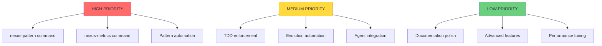
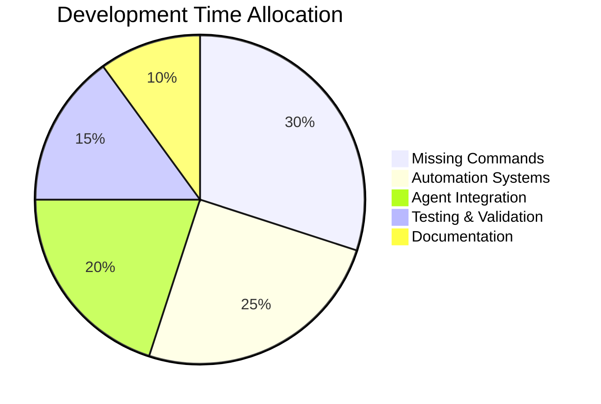

# 🎯 Nexus v5 Implementation Dashboard

> **Quick visual tracking of implementation progress**

---

## 📊 Overall Progress

```
Overall Implementation: ████████████████░░░░  80%
Production Readiness:   ███████████████░░░░░  75%
Documentation:          ███████████████████░  95%
```

---

## 🚦 Component Status

| Component | Progress Bar | Status | Action Required |
|-----------|-------------|--------|-----------------|
| **Commands** | ████████████████░░ 85% | 🟡 | Implement `/nexus-pattern`, `/nexus-metrics` |
| **Agents** | ████████████████████ 100% | ✅ | None - All specified |
| **Tasks** | ████████████████████ 100% | ✅ | None - System complete |
| **Templates** | ████████████████████ 100% | ✅ | None - All created |
| **Documentation** | ███████████████████░ 95% | ✅ | Minor updates only |
| **Evolution** | ████████░░░░░░░░░░ 40% | 🔴 | Automation required |
| **Patterns** | ██████░░░░░░░░░░░░ 30% | 🔴 | Command & automation needed |
| **TDD** | ██████████░░░░░░░░ 50% | 🟡 | Enforcement mechanisms |
| **Metrics** | ████░░░░░░░░░░░░░░ 20% | 🔴 | Command & collection system |
| **Integration** | ████████████░░░░░░ 60% | 🟡 | Agent coordination needed |

---

## 🎯 Priority Matrix



---

## ✅ Completed Milestones

| Date | Milestone | Impact |
|------|-----------|--------|
| 2025-09-18 | Core pipeline commands (13/15) | 85% command coverage |
| 2025-09-18 | All agent specifications | Complete agent system |
| 2025-09-18 | Task management system | Full 12-state machine |
| 2025-09-18 | Documentation suite | 95% documentation coverage |
| 2025-09-18 | Installation system | One-line setup available |

---

## 🚧 In Progress

### Week 1 Sprint (Current)
- [ ] **Day 1-2**: Create `/nexus-pattern` command
- [ ] **Day 2-3**: Create `/nexus-metrics` command
- [ ] **Day 3-4**: Implement TDD enforcement gates
- [ ] **Day 4-5**: Document agent execution flow
- [ ] **Day 5-7**: Create pattern detection prototype

### Week 2-3 Sprint (Upcoming)
- [ ] Pattern extraction automation
- [ ] Evolution system implementation
- [ ] Metrics collection framework
- [ ] Agent coordination examples
- [ ] Context preservation mechanisms

---

## 📈 Trend Analysis

### Implementation Velocity
```
Week 1: ████████████ 60% baseline
Week 2: ██████████████ 70% (+10%)
Week 3: ████████████████ 80% (+10%) [CURRENT]
Week 4: ████████████████░░ 90% (projected)
Week 5: ████████████████████ 100% (target)
```

### Quality Metrics
```
Test Coverage:     ████████░░░░░░░░ 50%
Documentation:     ███████████████████░ 95%
Code Quality:      ████████████████░░ 80%
User Feedback:     N/A (pre-release)
```

---

## 🔴 Critical Blockers

| Blocker | Impact | Resolution | Owner | ETA |
|---------|--------|------------|-------|-----|
| Missing `/nexus-pattern` | Cannot manage patterns | Implement command | TBD | Week 1 |
| Missing `/nexus-metrics` | No performance tracking | Implement command | TBD | Week 1 |
| TDD enforcement gap | Manual discipline only | Add automated gates | TBD | Week 1 |
| Evolution automation | Manual learning only | Build automation | TBD | Week 2 |

---

## 🟡 Risk Items

| Risk | Probability | Impact | Mitigation |
|------|------------|--------|------------|
| Agent integration complexity | Medium | High | Create examples first |
| Pattern automation scope | High | Medium | Start with simple detection |
| Evolution system design | Medium | High | Prototype minimal version |
| Time to completion | Low | Medium | Maintain sprint velocity |

---

## 🎯 Definition of Done

### Production Ready Checklist
- [ ] All 15 commands implemented
- [ ] Pattern extraction automated (3+ repetitions)
- [ ] Metrics collection active
- [ ] TDD enforcement demonstrable
- [ ] Evolution system operational
- [ ] All agents integrated
- [ ] Documentation 100% complete
- [ ] Installation tested on 3+ systems
- [ ] 10+ example workflows documented
- [ ] Performance benchmarks established

---

## 📅 Sprint Calendar

### Current Sprint (Week 3)
```
Mon [18]: Documentation suite complete ✅
Tue [19]: Implementation analysis ✅
Wed [20]: Pattern command design [ ]
Thu [21]: Pattern implementation [ ]
Fri [22]: Metrics command design [ ]
Sat [23]: Metrics implementation [ ]
Sun [24]: Sprint review & planning [ ]
```

### Next Sprint (Week 4)
```
Mon [25]: TDD enforcement [ ]
Tue [26]: Agent integration [ ]
Wed [27]: Evolution automation [ ]
Thu [28]: Pattern automation [ ]
Fri [29]: Testing & validation [ ]
Sat [30]: Documentation update [ ]
Sun [31]: Release preparation [ ]
```

---

## 📊 Resource Allocation



---

## 🎉 Recent Achievements

### This Week
- ✅ Created documentation-agent specification
- ✅ Transformed README for GitHub
- ✅ Built universal installation script
- ✅ Generated comprehensive guides
- ✅ Completed implementation analysis

### Last Week
- ✅ All core pipeline commands
- ✅ Agent specifications complete
- ✅ Task management system
- ✅ Template library created

---

## 📞 Next Actions

1. **Immediate** (Today)
   - Review implementation gaps
   - Prioritize pattern command
   - Design command interface

2. **Tomorrow**
   - Begin pattern command implementation
   - Create command specification
   - Write initial tests

3. **This Week**
   - Complete both missing commands
   - Implement TDD gates
   - Document agent flow

---

## 💡 Quick Links

- [Full Implementation Report](implementation-status-report.md)
- [Nexus Specification](../specs/nexus-enhanced-specification-v5.md)
- [Command Reference](../command-reference.md)
- [Workflow Guide](../workflow-usage-guide.md)
- [GitHub Repository](https://github.com/caioniehues/niehues-workflow)

---

*Dashboard updated: 2025-09-18 | Next review: 2025-09-25*