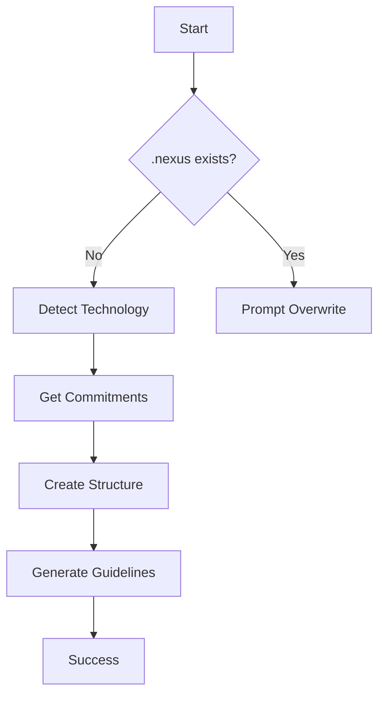
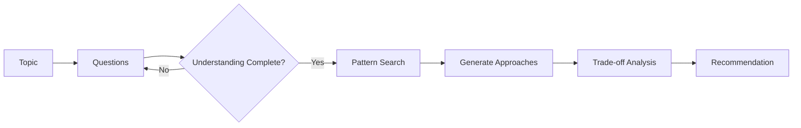
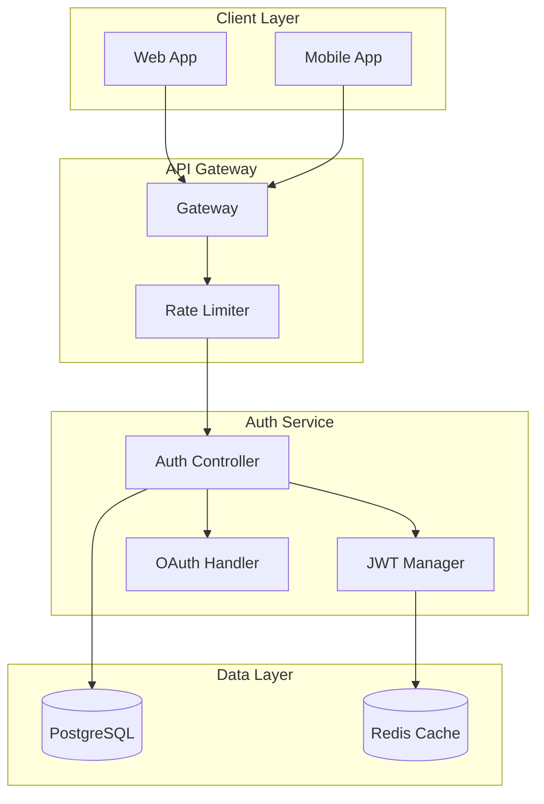
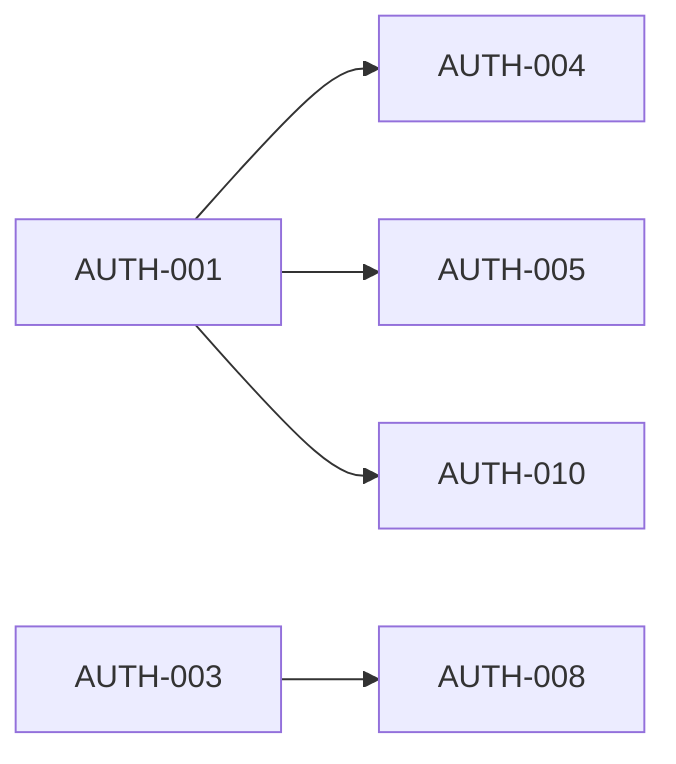
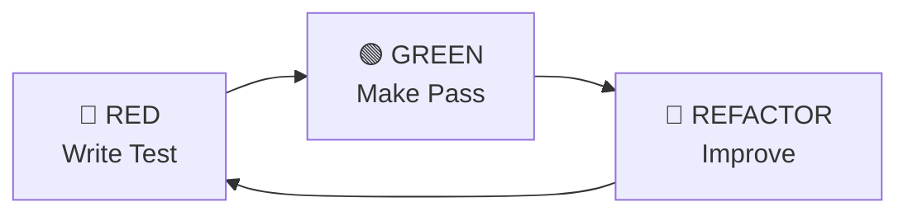
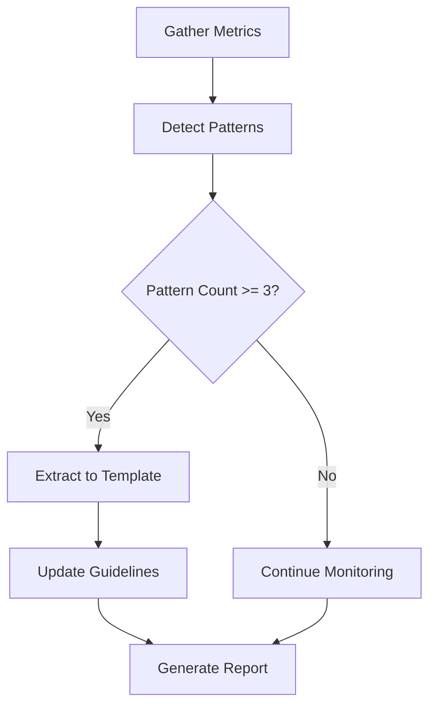
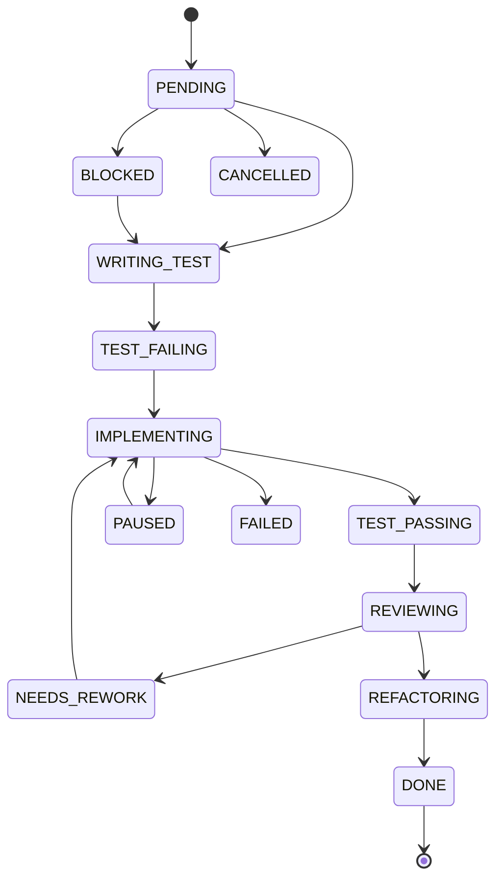

# 📘 Nexus Command Reference

> **Complete documentation for all Nexus workflow commands**

<div align="center">

[]()
[]()
[]()

</div>

---

## 📑 Table of Contents

### Pipeline Commands
1. [**/nexus-init**](#nexus-init) - Initialize workflow system
2. [**/nexus-brainstorm**](#nexus-brainstorm) - Generate solutions through questioning
3. [**/nexus-specify**](#nexus-specify) - Create formal specifications
4. [**/nexus-design**](#nexus-design) - Architectural design
5. [**/nexus-decompose**](#nexus-decompose) - Break into tasks
6. [**/nexus-implement**](#nexus-implement) - Execute with TDD
7. [**/nexus-validate**](#nexus-validate) - Quality verification
8. [**/nexus-evolve**](#nexus-evolve) - Learn and improve
9. [**/nexus-maintain**](#nexus-maintain) - Handle maintenance

### Utility Commands
10. [**/nexus-task**](#nexus-task) - Task management
11. [**/nexus-pattern**](#nexus-pattern) - Pattern extraction
12. [**/nexus-micro-evolve**](#nexus-micro-evolve) - Phase-specific evolution
13. [**/nexus-brainstorm-extended**](#nexus-brainstorm-extended) - Deep exploration
14. [**/nexus-specify-extended**](#nexus-specify-extended) - Detailed specification

---

## Pipeline Commands

### /nexus-init

**Initialize the Nexus workflow system for your project**

#### Syntax
```bash
/nexus-init [options]
```

#### Options
| Option | Description | Default |
|--------|-------------|---------|
| `--force` | Overwrite existing .nexus directory | false |
| `--minimal` | Create minimal structure | false |
| `--template <name>` | Use specific project template | auto-detect |

#### Process Flow


#### Interactive Example
```bash
/nexus-init

🚀 Initializing Nexus Workflow v5...

📋 Detecting project type...
  ✓ Node.js detected
  ✓ TypeScript configuration found
  ✓ Jest testing framework detected

📋 Workflow Commitments:
1. Will you use TDD (with documented exceptions)? [Y/n]: Y
2. Will you allow unlimited questioning? [Y/n]: Y

✨ Creating structure...
  ✓ Created .nexus/
  ✓ Created .nexus/brainstorms/
  ✓ Created .nexus/specs/
  ✓ Created .nexus/design/
  ✓ Created .nexus/tasks/
  ✓ Created .nexus/patterns/
  ✓ Created .nexus/evolution/

📝 Generating initial files...
  ✓ guidelines.md
  ✓ project-dna.md
  ✓ decision-log.md

✅ Nexus initialized successfully!
```

#### Output Files
```
.nexus/
├── guidelines.md          # Project-specific rules
├── project-dna.md         # Technology stack details
├── decision-log.md        # Decision tracking
├── brainstorms/           # Question sessions
├── specs/                 # Formal specifications
├── design/                # Architecture documents
├── tasks/                 # Task breakdowns
├── patterns/              # Extracted patterns
└── evolution/             # Learning logs
```

---

### /nexus-brainstorm

**Generate solution approaches through unlimited adaptive questioning**

#### Syntax
```bash
/nexus-brainstorm "<topic>" [options]
```

#### Parameters
| Parameter | Description | Required |
|-----------|-------------|----------|
| `topic` | Feature or problem to explore | ✅ Yes |

#### Options
| Option | Description | Default |
|--------|-------------|---------|
| `--focus <area>` | Narrow focus to specific area | broad |
| `--max-approaches <n>` | Maximum approaches to generate | 3 |
| `--pattern-search` | Search patterns library first | true |

#### Process Flow


#### Interactive Example
```bash
/nexus-brainstorm "implement user authentication with social login"

🤔 Starting unlimited questioning phase...

❓ Question 1: What authentication providers do you need to support?
> "Google, GitHub, and email/password"

❓ Question 2: Do you need multi-factor authentication (MFA)?
> "Yes, optional for users"

❓ Question 3: What's your session management approach?
> "JWT with refresh tokens"

❓ Question 4: How long should sessions last?
> "24 hours, with 7-day refresh"

❓ Question 5: Do you need role-based access control?
> "Yes, admin and user roles"

[... continues until complete understanding ...]

🔍 Searching pattern library...
  ✓ Found: auth-jwt-pattern.md
  ✓ Found: oauth-flow-pattern.md

💡 Generating approaches...

📊 Approach A: Passport.js Integration
  Pros: Battle-tested, extensive provider support
  Cons: Additional dependency, configuration complexity
  Risk: Medium
  Effort: 2-3 days

📊 Approach B: Custom JWT Implementation
  Pros: Full control, minimal dependencies
  Cons: Security responsibility, more code
  Risk: High
  Effort: 4-5 days

📊 Approach C: Auth0/Firebase Auth
  Pros: Managed service, built-in MFA
  Cons: Vendor lock-in, cost at scale
  Risk: Low
  Effort: 1-2 days

🎯 Recommendation: Approach A
Rationale: Best balance of security, flexibility, and implementation speed

📁 Saved to: .nexus/brainstorms/2025-01-18-143022-user-authentication.md
```

---

### /nexus-specify

**Transform brainstorm output into formal, testable specifications**

#### Syntax
```bash
/nexus-specify [options]
```

#### Options
| Option | Description | Default |
|--------|-------------|---------|
| `--from <file>` | Specific brainstorm file | latest |
| `--format <type>` | Output format (yaml/json/md) | yaml |
| `--bdd` | Include BDD scenarios | true |

#### Specification Structure
```yaml
Feature: User Authentication
Version: 1.0.0
Status: DRAFT
Created: 2025-01-18
Author: System

Requirements:
  functional:
    - FR-001: Users can register with email/password
    - FR-002: Support Google OAuth login
    - FR-003: Support GitHub OAuth login
    - FR-004: Implement JWT-based sessions
    - FR-005: Provide refresh token mechanism

  non_functional:
    - NFR-001: Authentication < 500ms
    - NFR-002: Support 10,000 concurrent sessions
    - NFR-003: OWASP compliance

Acceptance_Criteria:
  - GIVEN valid credentials
    WHEN user logs in
    THEN return JWT token with 24hr expiry

  - GIVEN expired token
    WHEN refresh requested with valid refresh token
    THEN issue new JWT token

Test_Scenarios:
  happy_path:
    - Successful email registration
    - Successful login
    - Token refresh

  edge_cases:
    - Duplicate email registration
    - Invalid credentials
    - Expired refresh token

Security_Requirements:
  - Passwords hashed with bcrypt (min rounds: 12)
  - Tokens signed with RS256
  - Rate limiting on auth endpoints
```

#### Example Usage
```bash
/nexus-specify

📋 Creating specification from latest brainstorm...

✓ Extracted 12 functional requirements
✓ Extracted 5 non-functional requirements
✓ Generated 8 acceptance criteria
✓ Created 15 test scenarios

📊 Coverage Analysis:
  - Requirements covered: 100%
  - Edge cases identified: 7
  - Security considerations: 5

📁 Saved to: .nexus/specs/user-authentication-spec.yaml
```

---

### /nexus-design

**Create secure, scalable architectural design**

#### Syntax
```bash
/nexus-design [options]
```

#### Options
| Option | Description | Default |
|--------|-------------|---------|
| `--type <type>` | Design type (system/component/data) | system |
| `--security-focus` | Enhanced security analysis | true |
| `--patterns` | Apply known patterns | true |

#### Design Output Example
```markdown
# Authentication System Design

## Architecture Overview



## Component Design

### AuthController
- **Responsibility**: Handle authentication requests
- **Interface**: REST API
- **Dependencies**: JWTManager, UserRepository
- **Patterns**: Controller, Repository

### JWTManager
- **Responsibility**: Token generation and validation
- **Algorithm**: RS256
- **Token TTL**: 24 hours
- **Refresh TTL**: 7 days

## Security Analysis
- **OWASP Top 10**: Addressed
- **Rate Limiting**: 5 attempts/15 minutes
- **Encryption**: TLS 1.3 required
- **Token Storage**: HttpOnly cookies + localStorage

## Data Models

```json
{
  "User": {
    "id": "uuid",
    "email": "string",
    "password_hash": "string",
    "oauth_providers": ["string"],
    "mfa_enabled": "boolean",
    "roles": ["string"],
    "created_at": "timestamp",
    "last_login": "timestamp"
  }
}
```
```

---

### /nexus-decompose

**Break design into T-shirt sized, manageable tasks**

#### Syntax
```bash
/nexus-decompose [options]
```

#### Options
| Option | Description | Default |
|--------|-------------|---------|
| `--max-size <size>` | Maximum task size (XS/S/M/L) | L |
| `--parallel` | Identify parallel tasks | true |
| `--dependencies` | Generate dependency graph | true |

#### Task Sizing Guide
```
┌──────────────────────────────────────┐
│       T-Shirt Sizing Reference       │
├──────────────────────────────────────┤
│  XS  │  < 30 minutes                │
│  S   │  30-60 minutes               │
│  M   │  1-2 hours                   │
│  L   │  2-4 hours                   │
│  XL  │  MUST SPLIT!                 │
└──────────────────────────────────────┘
```

#### Example Output
```bash
/nexus-decompose

📊 Analyzing design for task breakdown...

✂️ Generated 12 tasks:

┌─────────────────────────────────────────────────┐
│ ID      │ Task                   │ Size │ Deps │
├─────────────────────────────────────────────────┤
│ AUTH-001│ User model & schema    │ S    │ []   │
│ AUTH-002│ Password hashing util  │ XS   │ []   │
│ AUTH-003│ JWT token service      │ M    │ []   │
│ AUTH-004│ Registration endpoint  │ L    │ [001]│
│ AUTH-005│ Login endpoint         │ L    │ [001]│
│ AUTH-006│ OAuth Google setup [P] │ M    │ []   │
│ AUTH-007│ OAuth GitHub setup [P] │ M    │ []   │
│ AUTH-008│ Session management     │ M    │ [003]│
│ AUTH-009│ Rate limiting          │ S    │ []   │
│ AUTH-010│ MFA implementation     │ L    │ [001]│
│ AUTH-011│ Integration tests      │ L    │ [*]  │
│ AUTH-012│ Documentation          │ M    │ [*]  │
└─────────────────────────────────────────────────┘

[P] = Can be done in parallel
Total Effort: ~18 hours

📊 Dependency Graph:


📁 Saved to: .nexus/tasks/auth-tasks.yaml
```

---

### /nexus-implement

**Execute tasks using Test-Driven Development**

#### Syntax
```bash
/nexus-implement <task-id> [options]
```

#### Parameters
| Parameter | Description | Required |
|-----------|-------------|----------|
| `task-id` | Task identifier | ✅ Yes |

#### Options
| Option | Description | Default |
|--------|-------------|---------|
| `--exception <type>` | TDD exception (spike/hotfix/poc) | none |
| `--pair` | Enable pair programming mode | false |
| `--pattern <name>` | Apply specific pattern | auto |

#### TDD Cycle


#### Implementation Example
```bash
/nexus-implement AUTH-001

📋 Task: User model & schema
Size: S (30-60 minutes)
Dependencies: None

🔴 Step 1: RED - Writing failing test

Creating: tests/models/user.test.js
```javascript
describe('User Model', () => {
  test('creates user with valid email', () => {
    const user = new User({
      email: 'test@example.com',
      password: 'SecurePass123!'
    });

    expect(user.email).toBe('test@example.com');
    expect(user.id).toBeDefined();
    expect(user.password_hash).toBeDefined();
    expect(user.password_hash).not.toBe('SecurePass123!');
  });

  test('rejects invalid email', () => {
    expect(() => {
      new User({ email: 'invalid', password: 'pass' });
    }).toThrow('Invalid email format');
  });
});
```

Running tests...
❌ FAIL: User is not defined

🟢 Step 2: GREEN - Making test pass

Creating: src/models/user.js
```javascript
const bcrypt = require('bcrypt');
const { v4: uuidv4 } = require('uuid');

class User {
  constructor({ email, password }) {
    if (!this.validateEmail(email)) {
      throw new Error('Invalid email format');
    }

    this.id = uuidv4();
    this.email = email;
    this.password_hash = bcrypt.hashSync(password, 12);
    this.created_at = new Date();
  }

  validateEmail(email) {
    return /^[^\s@]+@[^\s@]+\.[^\s@]+$/.test(email);
  }
}

module.exports = User;
```

Running tests...
✅ PASS: All tests passing

🔵 Step 3: REFACTOR - Improving code

Refactoring suggestions:
- Extract validation to separate module
- Add password complexity validation
- Implement async hashing

Updated: src/models/user.js
```javascript
// Improved version with better structure
const bcrypt = require('bcrypt');
const { v4: uuidv4 } = require('uuid');
const { validateEmail, validatePassword } = require('../utils/validators');

class User {
  constructor({ email, password }) {
    this.validate(email, password);

    this.id = uuidv4();
    this.email = email;
    this.password_hash = this.hashPassword(password);
    this.created_at = new Date();
    this.roles = ['user'];
  }

  validate(email, password) {
    if (!validateEmail(email)) {
      throw new Error('Invalid email format');
    }
    if (!validatePassword(password)) {
      throw new Error('Password does not meet requirements');
    }
  }

  hashPassword(password) {
    return bcrypt.hashSync(password, 12);
  }

  async comparePassword(password) {
    return bcrypt.compare(password, this.password_hash);
  }
}

module.exports = User;
```

Running tests...
✅ PASS: All tests still passing

📊 Task Status:
- Tests Written: ✅
- Implementation: ✅
- Refactored: ✅
- Time Taken: 42 minutes

✅ Task AUTH-001 COMPLETED

Next task: /nexus-implement AUTH-002
```

---

### /nexus-validate

**Comprehensive quality verification**

#### Syntax
```bash
/nexus-validate [scope] [options]
```

#### Parameters
| Parameter | Description | Required |
|-----------|-------------|----------|
| `scope` | What to validate (task/feature/all) | No (default: all) |

#### Options
| Option | Description | Default |
|--------|-------------|---------|
| `--security` | Run security scan | true |
| `--performance` | Run performance tests | false |
| `--coverage` | Minimum coverage required | 80% |

#### Validation Checklist
```markdown
## Automated Validation

✅ Unit Tests
  - Tests Run: 127
  - Tests Passed: 127
  - Coverage: 94.3%

✅ Integration Tests
  - Tests Run: 23
  - Tests Passed: 23
  - API Coverage: 100%

✅ Code Quality
  - ESLint: 0 errors, 2 warnings
  - Prettier: All files formatted
  - Complexity: Within limits

✅ Security Scan
  - npm audit: 0 vulnerabilities
  - OWASP check: Passed
  - Secrets scan: Clean

⚠️ Performance
  - Load test: 950 req/s (target: 1000)
  - Response time: 89ms avg (target: <100ms)
  - Memory usage: Stable

## Manual Review Checklist

[ ] Code follows style guide
[ ] Documentation updated
[ ] Error messages helpful
[ ] Edge cases handled
[ ] Logging appropriate
```

#### Example Output
```bash
/nexus-validate

🔍 Starting comprehensive validation...

📊 Test Results:
├─ Unit Tests:        ✅ 127/127 passed (94.3% coverage)
├─ Integration Tests: ✅ 23/23 passed
├─ E2E Tests:         ✅ 8/8 passed
└─ Coverage Report:   ✅ Exceeds minimum (80%)

🔐 Security Analysis:
├─ Dependency Scan:   ✅ 0 vulnerabilities
├─ Code Security:     ✅ No issues found
├─ OWASP Compliance:  ✅ All checks passed
└─ Secrets Detection: ✅ No secrets found

📈 Code Quality:
├─ Linting:          ⚠️ 2 warnings (non-critical)
├─ Formatting:       ✅ All files formatted
├─ Complexity:       ✅ Within acceptable range
└─ Documentation:    ✅ 100% of public APIs

⚡ Performance:
├─ Load Test:        ⚠️ 950 req/s (target: 1000)
├─ Response Time:    ✅ 89ms average
├─ Memory Usage:     ✅ No memory leaks
└─ Database Queries: ✅ All indexed

📋 Summary:
- Total Checks: 24
- Passed: 22
- Warnings: 2
- Failed: 0

✅ Validation PASSED with minor warnings

📁 Full report: .nexus/validation/2025-01-18-validation-report.html
```

---

### /nexus-evolve

**Learn from implementation and improve workflow**

#### Syntax
```bash
/nexus-evolve [level] [options]
```

#### Parameters
| Parameter | Description | Required |
|-----------|-------------|----------|
| `level` | Evolution level (micro/continuous/formal) | No (auto) |

#### Options
| Option | Description | Default |
|--------|-------------|---------|
| `--force-extract` | Force pattern extraction | false |
| `--metrics` | Include detailed metrics | true |
| `--suggestions` | Generate improvement suggestions | true |

#### Evolution Process


#### Example Output
```bash
/nexus-evolve

🔄 Starting evolution analysis...

📊 Metrics Analysis:
- Pipeline Duration: 3 days
- Questions Asked: 47
- Tasks Completed: 12/12
- Test Coverage: 94.3%
- Rework Required: 2 tasks

🔍 Pattern Detection:
✓ Pattern Found: JWT token generation (4 occurrences)
  → Extracted to: templates/patterns/jwt-token-pattern.js

✓ Pattern Found: Validation middleware (3 occurrences)
  → Extracted to: templates/patterns/validation-middleware.js

✓ Question Pattern: "What about error handling?" (6 times)
  → Added to: .nexus/brainstorms/standard-questions.md

📈 Workflow Improvements:
1. Consider smaller task sizes (avg was 2.1 hours)
2. Add performance testing earlier in pipeline
3. Standardize error response format

🎯 Efficiency Gains:
- Next similar feature: ~40% faster
- Reusable patterns: 2 extracted
- Knowledge captured: 3 decision rationales

📝 Updates Made:
- ✅ Updated guidelines.md with new patterns
- ✅ Added 2 templates to library
- ✅ Enhanced questionnaire with 3 questions
- ✅ Logged 5 architectural decisions

📊 Evolution Score: 8.5/10
- Learning Rate: High
- Pattern Extraction: Successful
- Process Improvement: Moderate

📁 Full report: .nexus/evolution/2025-01-18-evolution.md

✨ Workflow evolved successfully!
```

---

### /nexus-maintain

**Handle maintenance tasks efficiently**

#### Syntax
```bash
/nexus-maintain <type> [options]
```

#### Parameters
| Parameter | Description | Required |
|-----------|-------------|----------|
| `type` | Maintenance type (bug/enhancement/refactor/update) | ✅ Yes |

#### Maintenance Types
| Type | Process | Timeline |
|------|---------|----------|
| `bug` | SPECIFY → IMPLEMENT → VALIDATE | Immediate |
| `enhancement` | BRAINSTORM → Full Pipeline | Next sprint |
| `refactor` | DESIGN → DECOMPOSE → IMPLEMENT | Tech debt sprint |
| `update` | VALIDATE → IMPLEMENT | Based on severity |

#### Example: Bug Fix
```bash
/nexus-maintain bug

🐛 Bug Fix Workflow

📋 Describe the bug:
> "Login fails for users with special characters in email"

🔍 Reproducing...
✓ Bug confirmed: URL encoding issue

📝 Quick Specification:
- Issue: Special chars not properly encoded
- Impact: ~5% of users affected
- Priority: High

🧪 Writing test first:
```javascript
test('handles email with + character', () => {
  const email = 'user+tag@example.com';
  const result = login(email, 'password');
  expect(result).toBe(true);
});
```

❌ Test failing (confirming bug)

🔧 Implementing fix:
```javascript
function sanitizeEmail(email) {
  return encodeURIComponent(email)
    .replace(/%40/g, '@')
    .replace(/%2B/g, '+');
}
```

✅ Test passing

📊 Validation:
- Regression tests: ✅ All passing
- Related tests: ✅ No breaks
- Manual testing: ✅ Confirmed fixed

✅ Bug fixed and deployed

Time taken: 47 minutes
```

---

## Utility Commands

### /nexus-task

**Comprehensive task management**

#### Syntax
```bash
/nexus-task <action> [task-id] [options]
```

#### Actions
| Action | Description | Example |
|--------|-------------|---------|
| `list` | List all tasks | `/nexus-task list` |
| `view` | View task details | `/nexus-task view AUTH-001` |
| `update` | Update task status | `/nexus-task update AUTH-001 --status DONE` |
| `split` | Split large task | `/nexus-task split AUTH-004` |
| `depend` | Add dependency | `/nexus-task depend AUTH-005 --on AUTH-001` |
| `parallel` | Mark as parallel | `/nexus-task parallel AUTH-006` |
| `assign` | Assign to team member | `/nexus-task assign AUTH-001 --to alice` |

#### Task States


#### Example: Task List View
```bash
/nexus-task list

📋 Current Tasks:

┌────────────────────────────────────────────────────┐
│ ID      │ Task             │ Status      │ Size │ ⏱️ │
├────────────────────────────────────────────────────┤
│ AUTH-001│ User model       │ ✅ DONE     │ S    │ 42m│
│ AUTH-002│ Password hash    │ ✅ DONE     │ XS   │ 18m│
│ AUTH-003│ JWT service      │ 🔄 TESTING  │ M    │ 1h │
│ AUTH-004│ Registration     │ 🚧 IMPLEMENT│ L    │ -- │
│ AUTH-005│ Login endpoint   │ ⏸️ BLOCKED  │ L    │ -- │
│ AUTH-006│ OAuth Google [P] │ 📝 PENDING  │ M    │ -- │
└────────────────────────────────────────────────────┘

Summary:
- Completed: 2/6 (33%)
- In Progress: 2/6 (33%)
- Blocked: 1/6 (17%)
- Total Effort: ~8 hours remaining
```

---

### /nexus-pattern

**Extract and manage reusable patterns**

#### Syntax
```bash
/nexus-pattern <action> [pattern-name] [options]
```

#### Actions
| Action | Description |
|--------|-------------|
| `detect` | Scan for patterns |
| `extract` | Extract pattern to template |
| `list` | List all patterns |
| `apply` | Apply pattern to code |

#### Example: Pattern Detection
```bash
/nexus-pattern detect

🔍 Scanning codebase for patterns...

📊 Patterns Detected:

1. Error Handler Middleware (5 occurrences)
   Files: auth.js, user.js, product.js, order.js, payment.js
   Similarity: 94%
   → Recommended for extraction

2. Validation Schema (4 occurrences)
   Files: user.dto.js, product.dto.js, order.dto.js, auth.dto.js
   Similarity: 87%
   → Recommended for extraction

3. Database Connection (3 occurrences)
   Files: db.js, cache.js, queue.js
   Similarity: 78%
   → Ready for extraction

Extract patterns? [Y/n]: Y

✅ Extracted 3 patterns to templates/patterns/
- error-handler.pattern.js
- validation-schema.pattern.js
- db-connection.pattern.js

These patterns will be automatically suggested in future implementations.
```

---

## Command Chaining

Commands can be chained for efficient workflow:

```bash
# Full feature pipeline
/nexus-brainstorm "shopping cart" && \
/nexus-specify && \
/nexus-design && \
/nexus-decompose && \
/nexus-implement --all

# Quick bug fix
/nexus-maintain bug && \
/nexus-validate

# Pattern extraction after feature
/nexus-evolve && \
/nexus-pattern detect && \
/nexus-pattern extract --all
```

---

## Quick Reference Card

```
┌─────────────────────────────────────────────────┐
│              NEXUS QUICK COMMANDS              │
├─────────────────────────────────────────────────┤
│ Start New Feature:                              │
│   /nexus-brainstorm "feature description"       │
│                                                 │
│ Initialize Project:                             │
│   /nexus-init                                   │
│                                                 │
│ View Tasks:                                     │
│   /nexus-task list                              │
│                                                 │
│ Implement with TDD:                             │
│   /nexus-implement TASK-ID                      │
│                                                 │
│ Validate Quality:                               │
│   /nexus-validate                               │
│                                                 │
│ Learn & Improve:                                │
│   /nexus-evolve                                 │
├─────────────────────────────────────────────────┤
│ Pipeline: B→S→D→DC→I→V→E→M                      │
│ Task Sizes: XS|S|M|L|XL(split)                 │
│ TDD: RED→GREEN→REFACTOR                         │
└─────────────────────────────────────────────────┘
```

---

## Environment Variables

Nexus respects these environment variables:

| Variable | Description | Default |
|----------|-------------|---------|
| `NEXUS_DIR` | Nexus data directory | `.nexus` |
| `NEXUS_PARALLEL` | Enable parallel execution | `true` |
| `NEXUS_TDD_STRICT` | Enforce strict TDD | `false` |
| `NEXUS_PATTERN_THRESHOLD` | Pattern detection threshold | `3` |
| `NEXUS_COVERAGE_MIN` | Minimum test coverage | `80` |

---

## Troubleshooting

### Common Issues

<details>
<summary><b>Command not found</b></summary>

```bash
# Check Claude integration
ls .claude/commands/

# Reinitialize if needed
/nexus-init --force
```
</details>

<details>
<summary><b>Task stuck in BLOCKED</b></summary>

```bash
# Check dependencies
/nexus-task view TASK-ID

# Force unblock if dependency resolved
/nexus-task update TASK-ID --status PENDING --force
```
</details>

<details>
<summary><b>Pattern not detected</b></summary>

```bash
# Lower threshold temporarily
NEXUS_PATTERN_THRESHOLD=2 /nexus-pattern detect

# Force pattern extraction
/nexus-pattern extract --force --similarity 70
```
</details>

---

## See Also

- [Workflow Usage Guide](workflow-usage-guide.md) - Complete methodology guide
- [Quick Start](quickstart.md) - 5-minute introduction
- [Examples](../examples/) - Real-world usage
- [Templates](../templates/) - Pattern library

---

<div align="center">

**Need help?** Check the [FAQ](faq.md) or [open an issue](https://github.com/yourusername/nexus-workflow-v5/issues)

</div>