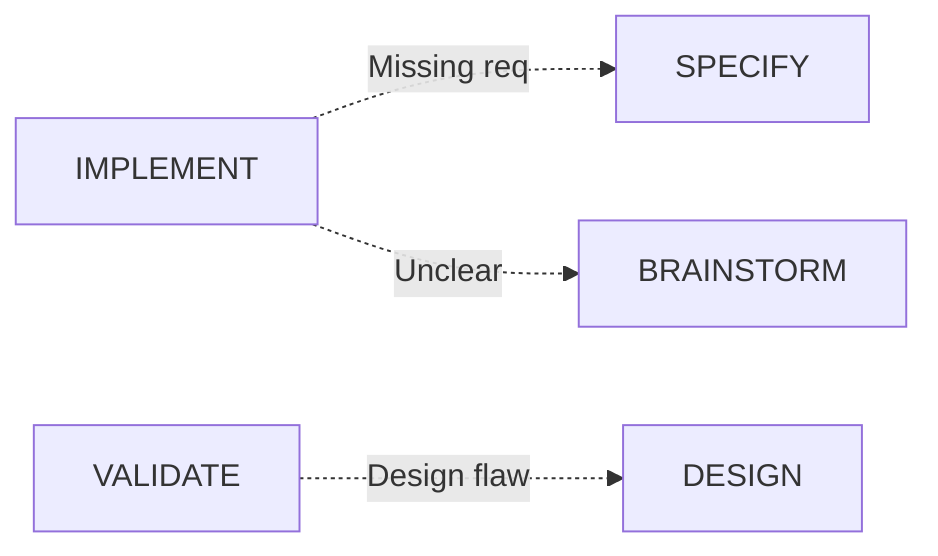

# ❓ Nexus Workflow FAQ

> **Frequently Asked Questions about the Nexus Enhanced Workflow v5**

<div align="center">

[]()
[]()
[]()

</div>

---

## 📑 Quick Navigation

- [**General Questions**](#-general-questions)
- [**Getting Started**](#-getting-started)
- [**Workflow & Pipeline**](#-workflow--pipeline)
- [**TDD & Testing**](#-tdd--testing)
- [**Task Management**](#-task-management)
- [**Pattern Evolution**](#-pattern-evolution)
- [**Troubleshooting**](#-troubleshooting)
- [**Best Practices**](#-best-practices)

---

## 🌟 General Questions

### What is Nexus?

<details open>
<summary><b>Is Nexus software that I install?</b></summary>

**No!** Nexus is a **methodology**, not software. It's a comprehensive workflow system implemented through Claude commands and file-based tracking. Think of it as a set of best practices and processes that guide your development, not a program that runs on your computer.

</details>

<details>
<summary><b>How is Nexus different from other methodologies like Agile or Scrum?</b></summary>

Nexus is specifically designed for AI-assisted development with these unique features:

| Feature | Nexus | Traditional Agile |
|---------|-------|-------------------|
| **Questioning** | Unlimited, adaptive | Fixed planning sessions |
| **Learning** | Continuous pattern extraction | Manual retrospectives |
| **TDD** | Flexible with documented exceptions | Varies by team |
| **Evolution** | Automatic workflow improvement | Manual process changes |
| **Task Sizing** | T-shirt sizes with hard limits | Story points |

</details>

<details>
<summary><b>Can I use Nexus without Claude?</b></summary>

While Nexus is designed specifically for Claude Code, the methodology principles can be adapted. However, you'd lose:
- Automatic command execution
- AI-powered questioning
- Pattern detection
- Intelligent task management

You could manually follow the workflow, but it's optimized for AI assistance.

</details>

<details>
<summary><b>Is Nexus suitable for team development?</b></summary>

Yes! Nexus can work for teams with these adaptations:
- Shared `.nexus/` directory in version control
- Task assignment features (`/nexus-task assign`)
- Parallel task marking for distribution
- Centralized pattern library
- Team guidelines in `.nexus/guidelines.md`

</details>

---

## 🚀 Getting Started

### Installation & Setup

<details>
<summary><b>How do I install Nexus?</b></summary>

Two ways:

**Option 1: Quick Install (Recommended)**
```bash
curl -sSL https://raw.githubusercontent.com/yourusername/nexus-workflow-v5/main/install.sh | bash
```

**Option 2: Manual Setup**
```bash
git clone https://github.com/yourusername/nexus-workflow-v5.git
cp -r nexus-workflow-v5/.claude your-project/
cp nexus-workflow-v5/CLAUDE.md your-project/
```

Then in Claude Code:
```bash
/nexus-init
```

</details>

<details>
<summary><b>What files/directories does Nexus create?</b></summary>

```
your-project/
├── .nexus/                 # Workflow data (gitignored by default)
│   ├── guidelines.md       # Your project rules
│   ├── brainstorms/        # Question sessions
│   ├── specs/              # Specifications
│   ├── design/             # Architecture docs
│   ├── tasks/              # Task breakdowns
│   ├── patterns/           # Extracted patterns
│   └── evolution/          # Learning logs
├── .claude/                # Claude commands
│   ├── commands/           # Command implementations
│   └── agents/             # Agent specifications
└── CLAUDE.md               # Claude instructions
```

</details>

<details>
<summary><b>Should I commit .nexus/ to version control?</b></summary>

**It depends:**

✅ **Commit these:**
- `.nexus/guidelines.md` - Team rules
- `.nexus/patterns/` - Reusable patterns
- `.nexus/specs/` - Feature specifications

⚠️ **Consider committing:**
- `.nexus/design/` - If team needs to review
- `.nexus/evolution/` - For process history

❌ **Don't commit:**
- `.nexus/brainstorms/` - Can be large and verbose
- `.nexus/tasks/` - Often changes rapidly

</details>

---

## 🔄 Workflow & Pipeline

### Understanding the Pipeline

<details>
<summary><b>Do I have to follow all 8 phases for every feature?</b></summary>

**No!** The pipeline is flexible:

- **New Features**: Usually full pipeline (BRAINSTORM → EVOLVE)
- **Bug Fixes**: Often just SPECIFY → IMPLEMENT → VALIDATE
- **Refactoring**: Might start at DESIGN → DECOMPOSE → IMPLEMENT
- **Hotfixes**: Can jump directly to IMPLEMENT with exception flag

The key is using the phases that add value for your specific task.

</details>

<details>
<summary><b>What does "backward navigation" mean?</b></summary>

You can jump back to any previous phase when you discover issues:



Examples:
- During IMPLEMENT, realize spec is incomplete → back to SPECIFY
- During VALIDATE, find architecture issue → back to DESIGN
- Any time you're confused → back to BRAINSTORM

</details>

<details>
<summary><b>How long should each phase take?</b></summary>

Rough guidelines for a medium feature:

| Phase | Typical Duration | Notes |
|-------|-----------------|-------|
| BRAINSTORM | 30-60 min | Depends on complexity |
| SPECIFY | 15-30 min | Faster with good brainstorm |
| DESIGN | 30-60 min | More for complex architecture |
| DECOMPOSE | 15-20 min | Quick with clear design |
| IMPLEMENT | 4-8 hours | Varies by feature size |
| VALIDATE | 30-45 min | Automated + manual review |
| EVOLVE | 15-20 min | Mostly automatic |
| MAINTAIN | Ongoing | As needed |

</details>

---

## 🧪 TDD & Testing

### Test-Driven Development

<details>
<summary><b>Do I HAVE to write tests first?</b></summary>

**Default: YES** - Write tests first following RED-GREEN-REFACTOR.

**Exceptions allowed:**
1. **Exploratory Spike** - Max 2 hours exploring, then write tests
2. **Emergency Hotfix** - Fix immediately, tests within 24 hours
3. **Proof of Concept** - Clearly marked as POC, not for production

Always document which exception you're using:
```bash
/nexus-implement TASK-001 --exception spike
```

</details>

<details>
<summary><b>What if I don't know how to test something?</b></summary>

Common solutions:

1. **Ask in BRAINSTORM phase**: "How would I test this?"
2. **Start with simple assertions**: What should definitely be true?
3. **Test the interface, not implementation**: Focus on inputs/outputs
4. **Use examples from specs**: Turn acceptance criteria into tests
5. **Pattern library**: Check `.nexus/patterns/` for test examples

Example progression:
```javascript
// Start simple
test('should return user data', () => {
  const user = getUser(1);
  expect(user).toBeDefined();
});

// Add specifics
test('should return user with correct fields', () => {
  const user = getUser(1);
  expect(user.id).toBe(1);
  expect(user.email).toMatch(/@/);
});
```

</details>

<details>
<summary><b>How much test coverage is enough?</b></summary>

Nexus defaults:
- **Minimum**: 80% code coverage
- **Target**: 90%+ for critical paths
- **Required**: 100% for security-related code

But coverage isn't everything:
- Quality > Quantity
- Edge cases > Happy paths
- Integration tests for workflows
- E2E tests for critical user journeys

</details>

---

## 📊 Task Management

### Task Sizing & States

<details>
<summary><b>What if my task is estimated as XL?</b></summary>

**MUST SPLIT!** Tasks larger than L (4 hours) must be broken down.

How to split:
```bash
/nexus-task split TASK-001

# Splits into:
TASK-001a: Setup and configuration (S)
TASK-001b: Core implementation (M)
TASK-001c: Error handling (S)
TASK-001d: Tests and docs (M)
```

Splitting strategies:
- By layer (UI, API, Database)
- By operation (Create, Read, Update, Delete)
- By complexity (Simple case, Edge cases)
- By dependency (Independent pieces)

</details>

<details>
<summary><b>What do the [P] markers mean on tasks?</b></summary>

`[P]` = **Parallel executable** - Can be worked on simultaneously

```
AUTH-001: User model        (no marker - sequential)
AUTH-002: Password util [P]  (can start immediately)
AUTH-003: JWT service [P]    (can start immediately)
AUTH-004: Login endpoint     (depends on AUTH-001)
```

Benefits:
- Team members can work simultaneously
- Faster overall completion
- Better resource utilization

</details>

<details>
<summary><b>How do I handle blocked tasks?</b></summary>

When blocked:

1. **Update status**:
```bash
/nexus-task update TASK-001 --status BLOCKED --reason "Waiting for API specs"
```

2. **Find other work**:
```bash
/nexus-task list --status PENDING --parallel
```

3. **Resolution strategies**:
- Work on parallel tasks
- Jump back to earlier phase for clarity
- Document the blocker
- Set reminder for follow-up

</details>

---

## 🎯 Pattern Evolution

### Pattern Extraction

<details>
<summary><b>When are patterns automatically extracted?</b></summary>

Patterns are extracted when:

| Type | Threshold | Action |
|------|-----------|--------|
| Code pattern | 3+ similar implementations | Extract to template |
| Question | Asked 5+ times | Add to questionnaire |
| Error handling | 3+ similar approaches | Create error template |
| Test pattern | 3+ similar test setups | Create test template |

You can also force extraction:
```bash
/nexus-pattern extract --force --threshold 2
```

</details>

<details>
<summary><b>How do I use extracted patterns?</b></summary>

Patterns are automatically suggested during implementation:

```bash
/nexus-implement AUTH-005

🔍 Found relevant patterns:
- jwt-token-pattern.js (80% match)
- validation-middleware.js (65% match)

Apply pattern? [Y/n]: Y
```

Manual application:
```bash
/nexus-pattern apply jwt-token-pattern --to src/auth/token.js
```

</details>

<details>
<summary><b>Can I create custom patterns manually?</b></summary>

Yes! Create in `templates/patterns/`:

```javascript
// templates/patterns/custom-api-endpoint.js
/**
 * Pattern: REST API Endpoint
 * Usage: Standard CRUD endpoint
 * Detected: Manual entry
 */

module.exports = {
  pattern: `
router.post('/${ENDPOINT}',
  validateRequest(${SCHEMA}),
  authenticate,
  async (req, res) => {
    try {
      const result = await ${SERVICE}.create(req.body);
      res.status(201).json(result);
    } catch (error) {
      next(error);
    }
  }
);`,
  variables: ['ENDPOINT', 'SCHEMA', 'SERVICE']
};
```

</details>

---

## 🔧 Troubleshooting

### Common Issues

<details>
<summary><b>Commands not working in Claude</b></summary>

**Checklist:**
1. ✅ Ensure `.claude/commands/` exists
2. ✅ Check CLAUDE.md is present
3. ✅ Verify command files have correct format
4. ✅ Try `/nexus-init --force` to reinitialize

**Debug steps:**
```bash
# List available commands
ls .claude/commands/

# Check command format
head -20 .claude/commands/nexus-brainstorm.md

# Reinitialize if needed
/nexus-init --force
```

</details>

<details>
<summary><b>Lost in the middle of the workflow</b></summary>

**Recovery steps:**

1. **Check current status**:
```bash
/nexus-task list --in-progress
```

2. **Review recent work**:
```bash
ls -la .nexus/brainstorms/
ls -la .nexus/specs/
```

3. **Jump to appropriate phase**:
- Confused about requirements? → `/nexus-brainstorm`
- Unclear task? → `/nexus-task view TASK-ID`
- Implementation issues? → Check patterns

4. **Use backward navigation**:
```bash
# Go back to get clarity
/nexus-specify --update
/nexus-design --revise
```

</details>

<details>
<summary><b>Too many questions in brainstorm phase</b></summary>

**This is actually good!** But if overwhelmed:

1. **Take breaks**: Answer in batches
2. **"I don't know"**: Valid answer, helps identify unknowns
3. **Time-box**: Set exploration limits
4. **Focus mode**: Use `--focus` flag:
```bash
/nexus-brainstorm "auth" --focus security
```

5. **Review patterns**: Previous questions become templates

Remember: More questions = fewer bugs

</details>

<details>
<summary><b>Tests keep failing</b></summary>

**Debugging strategy:**

1. **Verify test is correct**:
- Is the test testing the right thing?
- Are assertions reasonable?

2. **Simplify**:
```javascript
// Start with most basic test
test('function exists', () => {
  expect(myFunction).toBeDefined();
});
```

3. **Check environment**:
- Dependencies installed?
- Test database connected?
- Mocks configured?

4. **Review TDD cycle**:
- Did you write test first? (RED)
- Is implementation minimal? (GREEN)
- Can you simplify? (REFACTOR)

</details>

---

## ✨ Best Practices

### Workflow Optimization

<details>
<summary><b>How do I work faster with Nexus?</b></summary>

**Speed tips:**

1. **Build pattern library early**:
   - Extract patterns aggressively
   - Reuse speeds up implementation

2. **Batch similar tasks**:
   - Group API endpoints
   - Group database models
   - Apply patterns in bulk

3. **Use parallel tasks**:
   - Mark independent work with [P]
   - Work on multiple tasks simultaneously

4. **Skip phases when appropriate**:
   - Bug fixes: Skip BRAINSTORM
   - Refactoring: Skip SPECIFY
   - Hotfixes: Direct to IMPLEMENT

5. **Learn from evolution**:
   - Review evolution reports
   - Apply suggestions immediately

</details>

<details>
<summary><b>What makes a good brainstorm session?</b></summary>

**Quality indicators:**

✅ **Good Brainstorm:**
- Covers edge cases
- Identifies constraints
- Explores alternatives
- Questions "why" not just "what"
- Considers future changes

❌ **Poor Brainstorm:**
- Surface-level questions only
- Rushes to implementation
- Ignores edge cases
- Assumes too much
- Single solution focus

**Pro tip**: If you're not discovering something new, keep questioning!

</details>

<details>
<summary><b>When should I run /nexus-evolve?</b></summary>

**Run evolution:**

✅ **Always after:**
- Completing a feature
- Finishing a sprint
- Major refactoring
- Repeated similar tasks

⚠️ **Consider after:**
- Finding repeated bugs
- Team retrospectives
- Performance reviews

**Frequency guidelines:**
- Minimum: After each feature
- Recommended: Weekly
- Ideal: After every pipeline completion

</details>

---

## 📚 Advanced Topics

### Customization

<details>
<summary><b>Can I customize the workflow for my team?</b></summary>

Yes! Customization points:

1. **Edit `.nexus/guidelines.md`**:
```markdown
# Project Guidelines

## Task Sizing (Customized)
- XS: < 15 minutes
- S: 15-30 minutes
- M: 30-90 minutes
- L: 90-180 minutes

## TDD Exceptions (Additional)
- UI Components: Visual tests acceptable
- Database Migrations: Test in staging
```

2. **Modify commands** in `.claude/commands/`

3. **Add custom agents** in `.claude/agents/`

4. **Create project templates** in `templates/`

</details>

<details>
<summary><b>How do I integrate with existing tools?</b></summary>

Nexus is file-based, making integration easy:

**CI/CD Integration:**
```yaml
# .github/workflows/nexus.yml
- name: Check Nexus Tasks
  run: |
    if [ -f ".nexus/tasks/current.yaml" ]; then
      echo "Active tasks found"
      cat .nexus/tasks/current.yaml
    fi
```

**Git Hooks:**
```bash
# .git/hooks/pre-commit
#!/bin/bash
# Ensure no XL tasks
if grep -r "size: XL" .nexus/tasks/; then
  echo "Error: XL tasks must be split!"
  exit 1
fi
```

**Project Management:**
- Export tasks to JIRA/Trello
- Sync patterns to documentation
- Generate reports from evolution logs

</details>

---

## 🆘 Getting Help

### Support Resources

<details>
<summary><b>Where can I get help with Nexus?</b></summary>

1. **Documentation**:
   - [Workflow Guide](workflow-usage-guide.md)
   - [Command Reference](command-reference.md)
   - [Quick Start](quickstart.md)

2. **Examples**:
   - Check `examples/` directory
   - Review `.nexus/patterns/`

3. **Community**:
   - GitHub Issues
   - Discussions board
   - Share patterns and learnings

4. **In-workflow help**:
```bash
/nexus-help [command]
/nexus-task help
/nexus-pattern list
```

</details>

<details>
<summary><b>How do I report bugs or suggest improvements?</b></summary>

Since Nexus is a methodology, "bugs" are usually process issues:

**Process Issues**:
- Document in `.nexus/evolution/issues.md`
- Discuss in team retrospective
- Adjust `.nexus/guidelines.md`

**Command Issues**:
- Check `.claude/commands/` for the command
- Verify format and syntax
- Submit PR with fix

**Feature Requests**:
- Use evolution system to identify needs
- Propose in GitHub Discussions
- Submit PR with implementation

</details>

---

## 💡 Tips & Tricks

### Power User Features

<details>
<summary><b>Hidden features and shortcuts</b></summary>

**Command Chaining:**
```bash
# Full pipeline
/nexus-brainstorm "feature" && /nexus-specify && /nexus-design

# Quick validation
/nexus-implement TASK-001 && /nexus-validate --quick
```

**Environment Variables:**
```bash
NEXUS_PATTERN_THRESHOLD=2 /nexus-pattern detect
NEXUS_TDD_STRICT=true /nexus-implement TASK-001
NEXUS_COVERAGE_MIN=95 /nexus-validate
```

**Batch Operations:**
```bash
# Implement all small tasks
/nexus-task list --size XS,S | /nexus-implement --batch

# Extract all patterns
/nexus-pattern detect && /nexus-pattern extract --all
```

**Focus Modes:**
```bash
/nexus-brainstorm "auth" --focus security
/nexus-validate --focus performance
/nexus-evolve --focus patterns
```

</details>

---

<div align="center">

## Still have questions?

Can't find what you're looking for?

[**Open an Issue**](https://github.com/yourusername/nexus-workflow-v5/issues) | [**Read the Docs**](workflow-usage-guide.md) | [**Check Examples**](../examples/)

---

**Remember: There are no stupid questions - that's the Nexus philosophy!**

</div>