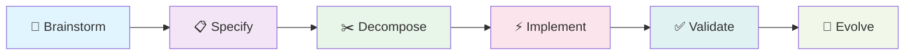

# 🚀 Nexus Quick Start Guide

> **Get your first feature running with Nexus in just 5 minutes!**

<div align="center">

[]()
[]()
[]()

</div>

---

## 📋 Prerequisites

Before starting, ensure you have:
- ✅ **Claude Code** (claude.ai/code) open
- ✅ **A project directory** ready
- ✅ **5 minutes** of uninterrupted time

---

## ⏱️ Your 5-Minute Journey

### Minute 0: Installation (30 seconds)

<details open>
<summary><b>🔧 Option 1: Quick Install (Recommended)</b></summary>

```bash
# Run this in your project directory
curl -sSL https://raw.githubusercontent.com/yourusername/nexus-workflow-v5/main/install.sh | bash -s -- --local
```

</details>

<details>
<summary><b>📦 Option 2: Manual Setup</b></summary>

```bash
# Clone and copy files
git clone https://github.com/yourusername/nexus-workflow-v5.git temp-nexus
cp -r temp-nexus/.claude ./
cp temp-nexus/CLAUDE.md ./
rm -rf temp-nexus
```

</details>

---

### Minute 1: Initialize Nexus

```bash
/nexus-init
```

**You'll see:**
```
🚀 Initializing Nexus Workflow v5...

📋 Workflow Commitments:
1. ✅ Use TDD (with documented exceptions)? [Y/n]: Y
2. ✅ Allow unlimited questioning? [Y/n]: Y

✨ Created .nexus/ directory structure
📝 Generated initial guidelines
🎯 Ready to start!
```

<details>
<summary>📁 <b>What was created?</b></summary>

```
.nexus/
├── guidelines.md       # Your project-specific rules
├── brainstorms/        # Question sessions
├── specs/              # Formal specifications
├── design/             # Architecture designs
├── tasks/              # Task breakdowns
├── patterns/           # Extracted patterns
└── evolution/          # Learning logs
```

</details>

---

### Minute 2: Brainstorm Your First Feature

```bash
/nexus-brainstorm "simple todo list with priorities"
```

**Interactive Q&A begins:**

```markdown
🤔 Question 1: What operations do you need for todos?
> "Create, read, update, delete, mark complete"

🤔 Question 2: How should priorities work?
> "Three levels: high, medium, low"

🤔 Question 3: Do you need due dates?
> "Yes, but optional"

🤔 Question 4: Multi-user or single-user?
> "Single user for now"

[... continues until complete understanding ...]

✅ Generated 3 solution approaches
📁 Saved to: .nexus/brainstorms/2025-01-18-todo-list.md
```

---

### Minute 3: Create Formal Specification

```bash
/nexus-specify
```

**Automatic specification generation:**

```yaml
Feature: Todo List Management
Version: 1.0.0
Status: DRAFT

Functional Requirements:
  ✓ FR-001: Create todo with title (required)
  ✓ FR-002: Set priority level (high/medium/low)
  ✓ FR-003: Add optional due date
  ✓ FR-004: Mark todo as complete
  ✓ FR-005: Delete todo items

Acceptance Criteria:
  ✓ Todo creation with minimum title
  ✓ Priority defaults to 'medium'
  ✓ Completed todos remain visible
  ✓ Due dates in ISO format

📁 Saved to: .nexus/specs/todo-list-spec.md
```

---

### Minute 4: Decompose Into Tasks

```bash
/nexus-decompose
```

**Smart task breakdown with T-shirt sizing:**

```markdown
📊 Task Breakdown Created:

┌────────────────────────────────────────────┐
│ ID   │ Task                │ Size │ Time   │
├────────────────────────────────────────────┤
│ T001 │ Todo model tests    │ S    │ 30 min │
│ T002 │ Todo model impl     │ M    │ 1 hr   │
│ T003 │ Priority tests      │ XS   │ 15 min │
│ T004 │ API endpoint tests  │ M    │ 1.5 hr │
│ T005 │ API implementation  │ L    │ 3 hr   │
└────────────────────────────────────────────┘

✅ 5 tasks created (Total: ~6 hours)
📁 Saved to: .nexus/tasks/todo-list-tasks.md
```

---

### Minute 5: Start Your First Implementation

```bash
/nexus-implement T001
```

**TDD workflow begins:**

```javascript
// Step 1: RED - Write failing test
// File: tests/todo.test.js

test('creates todo with required title', () => {
  const todo = new Todo('Buy groceries');
  expect(todo.title).toBe('Buy groceries');
  expect(todo.priority).toBe('medium');
  expect(todo.completed).toBe(false);
});

// ❌ Test fails (Todo class doesn't exist)

// Step 2: GREEN - Minimal implementation
// File: src/todo.js

class Todo {
  constructor(title) {
    this.title = title;
    this.priority = 'medium';
    this.completed = false;
  }
}

// ✅ Test passes!

// Step 3: REFACTOR - Improve if needed
// (Keep it simple for now)
```

**Status Update:**
```
✅ Task T001: COMPLETED
⏭️ Next: /nexus-implement T002
```

---

## 🎉 Congratulations!

**You've just:**
- ✅ Initialized Nexus workflow
- ✅ Brainstormed with unlimited questions
- ✅ Created formal specifications
- ✅ Decomposed into sized tasks
- ✅ Started TDD implementation

---

## 🔄 Your Workflow Loop



---

## 📝 Next Steps

### Continue Your Feature
```bash
# Implement remaining tasks
/nexus-implement T002
/nexus-implement T003

# Validate when complete
/nexus-validate

# Learn from the experience
/nexus-evolve
```

### Essential Commands

| Command | Purpose | When to Use |
|---------|---------|-------------|
| `/nexus-task list` | View all tasks | Check progress |
| `/nexus-task update T001` | Update task status | Change state |
| `/nexus-brainstorm` | Start new feature | New work |
| `/nexus-maintain` | Handle bugs/updates | Maintenance |

---

## 💡 Pro Tips for Success

### 1. Embrace the Questions
```diff
- ❌ "That's enough questions, let's code"
+ ✅ "More questions mean fewer bugs"
```

### 2. Trust the TDD Process
```diff
- ❌ Write code, then maybe tests
+ ✅ RED → GREEN → REFACTOR
```

### 3. Keep Tasks Small
```markdown
XS = < 30 min  ✅
S  = 30-60 min ✅
M  = 1-2 hours ✅
L  = 2-4 hours ⚠️ (consider splitting)
XL = > 4 hours ❌ (must split!)
```

### 4. Navigate Backwards When Needed
```bash
# Found missing requirement during implementation?
/nexus-specify --update

# Design issue discovered?
/nexus-design --revise
```

### 5. Let It Learn
```bash
# After completing features
/nexus-evolve

# Check extracted patterns
ls .nexus/patterns/
```

---

## 🆘 Quick Troubleshooting

<details>
<summary><b>❓ "Command not found"</b></summary>

```bash
# Ensure Claude Code is active
# Check .claude/commands/ exists
ls .claude/commands/
```

</details>

<details>
<summary><b>❓ "Too many questions"</b></summary>

The questioning phase ensures complete understanding. If overwhelmed:
- Take a break
- Answer "I don't know yet" when uncertain
- Questions will adapt to your responses

</details>

<details>
<summary><b>❓ "Task too large"</b></summary>

```bash
# Split large tasks
/nexus-task split T005

# Creates:
# T005a: API route setup (S)
# T005b: Request handling (M)
# T005c: Response formatting (S)
```

</details>

---

## 📚 Learn More

| Resource | Description | Link |
|----------|-------------|------|
| **Full Workflow Guide** | Complete methodology | [workflow-usage-guide.md](workflow-usage-guide.md) |
| **Command Reference** | All commands detailed | [command-reference.md](command-reference.md) |
| **Example Projects** | Real-world usage | [examples/](../examples/) |
| **Pattern Library** | Reusable templates | [templates/](../templates/) |

---

## 🚀 Ready for More?

You've completed your first Nexus workflow cycle! The system is now learning from your patterns and will improve with each use.

<div align="center">

### **Your Next Challenge:**

Try implementing a more complex feature and watch how Nexus adapts to your style!

```bash
/nexus-brainstorm "user authentication with JWT"
```

---

**Welcome to development with Nexus - where quality comes from understanding!**

[Back to Top ↑](#-nexus-quick-start-guide)

</div>