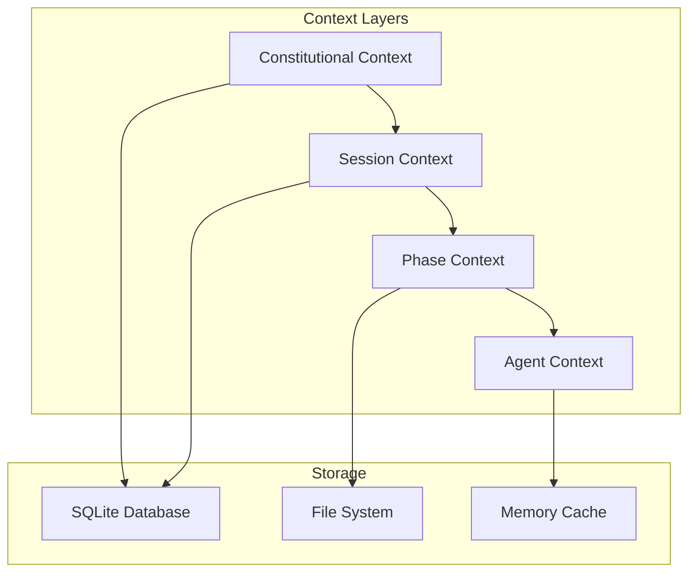

# Nexus Workflow User Guide

This comprehensive guide walks you through using the Nexus Workflow system, from initial setup to advanced usage patterns. Whether you're new to TDD or an experienced developer, this guide will help you leverage Nexus's constitutional approach to software development.

## Table of Contents

- [Getting Started](#getting-started)
- [Your First Workflow](#your-first-workflow)
- [Understanding the Constitutional Framework](#understanding-the-constitutional-framework)
- [Phase-by-Phase Guide](#phase-by-phase-guide)
- [Working with Context](#working-with-context)
- [Advanced Usage](#advanced-usage)
- [Best Practices](#best-practices)
- [Troubleshooting](#troubleshooting)
- [Integration Guide](#integration-guide)

## Getting Started

### Prerequisites

Before using Nexus, ensure you have:

- **Node.js** ≥ 20.0.0
- **npm** or **yarn**
- **Git** (for version control integration)
- A code editor (VS Code recommended)
- Basic understanding of test-driven development

### Installation

```bash
# Clone the repository
git clone https://github.com/your-username/nexus-workflow.git
cd nexus-workflow

# Install dependencies
npm install

# Build the project
npm run build

# Verify installation
npm test
```

### Project Setup

Initialize Nexus in your project directory:

```bash
# Navigate to your project
cd /path/to/your/project

# Initialize Nexus
npx nexus init --name "my-awesome-project"
```

This creates the `.nexus` directory with constitutional framework and project configuration.

## Your First Workflow

Let's walk through implementing a simple user authentication feature using Nexus.

### Step 1: Initialize the Project

```bash
mkdir auth-service
cd auth-service
npx nexus init --name "Authentication Service"
```

You'll be prompted to commit to TDD practices:

```
🎯 Constitutional Commitment Required

The Nexus workflow enforces immutable TDD principles:
- All code must be preceded by failing tests
- Red-Green-Refactor cycle is mandatory
- No production code without tests first

Do you commit to following these constitutional principles? (y/N)
```

Type `y` to proceed. This commitment is binding and cannot be overridden.

### Step 2: Brainstorm the Feature

```bash
npx nexus brainstorm --output auth-brainstorm.md
```

Nexus will ask adaptive questions to understand your requirements:

```
🧠 Adaptive Brainstorming Session

Let's explore your authentication requirements...

Q1: What type of authentication are you implementing?
   a) Username/password
   b) OAuth/social login
   c) Multi-factor authentication
   d) Token-based (JWT)
   e) Other

Please select or describe: a

Q2: What user information needs to be stored?
Current confidence: 65% - Need more details

Your answer: Email, password hash, profile information, creation date

Q3: What security requirements must be met?
Current confidence: 78% - Getting clearer

Your answer: Password hashing, secure sessions, rate limiting, email verification
```

The session continues until confidence reaches ≥85% (constitutional requirement).

**Generated Output (`auth-brainstorm.md`):**
```markdown
# Authentication Service Brainstorm

## Topic
User authentication system with email/password

## Approaches Considered
1. Simple username/password with sessions
2. JWT-based stateless authentication
3. OAuth integration with social providers

## Selected Approach
JWT-based authentication with email verification

**Rationale:** Provides scalability, stateless design, and modern security practices

## Requirements Clarified
- Email/password registration and login
- JWT token generation and validation
- Password hashing with bcrypt
- Email verification workflow
- Rate limiting for authentication endpoints
- User profile management

## Confidence Level
87% - Ready for specification phase
```

### Step 3: Generate Specifications

```bash
npx nexus specify --input auth-brainstorm.md --output auth-spec.md
```

Nexus generates detailed technical specifications:

**Generated Output (`auth-spec.md`):**
```markdown
# Authentication Service Technical Specification

## Architecture Overview
RESTful API with JWT authentication using Express.js and MongoDB

## API Endpoints

### POST /auth/register
- **Purpose:** User registration with email verification
- **Input:** `{ email: string, password: string, name: string }`
- **Output:** `{ message: string, verificationRequired: boolean }`
- **Validation:** Email format, password strength (8+ chars, mixed case, numbers)

### POST /auth/login
- **Purpose:** User authentication
- **Input:** `{ email: string, password: string }`
- **Output:** `{ token: string, user: UserProfile }`
- **Rate Limiting:** 5 attempts per IP per minute

### POST /auth/verify
- **Purpose:** Email verification
- **Input:** `{ token: string }`
- **Output:** `{ verified: boolean, message: string }`

## Data Models

### User
```typescript
interface User {
  id: string;
  email: string;
  passwordHash: string;
  name: string;
  isVerified: boolean;
  createdAt: Date;
  lastLogin: Date;
}
```

## Test Scenarios

### Scenario 1: User Registration
- **Given:** Valid user details
- **When:** POST to /auth/register
- **Then:** User created, verification email sent

### Scenario 2: Login with Unverified Email
- **Given:** Unverified user attempts login
- **When:** POST to /auth/login
- **Then:** Login denied, verification message shown

### Scenario 3: JWT Token Validation
- **Given:** Valid JWT token in Authorization header
- **When:** Request to protected endpoint
- **Then:** Request allowed, user context available
```

### Step 4: Decompose into Tasks

```bash
npx nexus decompose --input auth-spec.md --output ./tasks
```

Nexus breaks the specification into atomic, testable tasks:

**Generated Files:**
```
tasks/
├── task-001-setup-project-structure.md
├── task-002-user-model-tests.md
├── task-003-user-model-implementation.md
├── task-004-password-hashing-tests.md
├── task-005-password-hashing-implementation.md
├── task-006-jwt-service-tests.md
├── task-007-jwt-service-implementation.md
├── task-008-registration-endpoint-tests.md
├── task-009-registration-endpoint-implementation.md
├── task-010-login-endpoint-tests.md
├── task-011-login-endpoint-implementation.md
├── task-012-verification-endpoint-tests.md
├── task-013-verification-endpoint-implementation.md
├── task-014-rate-limiting-tests.md
├── task-015-rate-limiting-implementation.md
└── task-dependencies.json
```

Each task is estimated and includes dependencies:

**Example Task (`task-002-user-model-tests.md`):**
```markdown
# Task 002: User Model Tests

## Description
Write comprehensive tests for the User model including validation, serialization, and password handling.

## Estimated Time
30 minutes

## Dependencies
- task-001-setup-project-structure

## Files to Create/Modify
- `tests/models/User.test.ts`
- `src/models/User.ts` (interface only)

## Test Cases Required
1. User creation with valid data
2. Email validation (format, uniqueness)
3. Password strength validation
4. User serialization (exclude password)
5. Email verification status tracking

## Constitutional Requirements
- All tests must be written BEFORE implementation
- Minimum 80% coverage required
- Tests must follow Red-Green-Refactor pattern

## Acceptance Criteria
- [ ] All test cases implemented
- [ ] Tests fail initially (Red phase)
- [ ] Interface/types defined
- [ ] No implementation code written yet
```

### Step 5: Implement with TDD Enforcement

```bash
npx nexus implement --task ./tasks/task-002-user-model-tests.md
```

Nexus enforces constitutional TDD compliance:

```
🔒 Constitutional TDD Enforcement Active

Starting implementation of: User Model Tests

Phase 1: Red - Writing Failing Tests
✅ Test file created: tests/models/User.test.ts
✅ Tests written and failing
✅ No implementation code detected

Phase 2: Green - Minimal Implementation
🚫 Implementation blocked until tests are failing
```

The system ensures you cannot write implementation code until failing tests exist:

```typescript
// tests/models/User.test.ts (automatically guided creation)
import { User } from '../../src/models/User';

describe('User Model', () => {
  test('should create user with valid data', () => {
    const userData = {
      email: 'test@example.com',
      password: 'SecurePass123',
      name: 'Test User'
    };

    const user = new User(userData);

    expect(user.email).toBe(userData.email);
    expect(user.name).toBe(userData.name);
    expect(user.isVerified).toBe(false);
    expect(user.passwordHash).toBeDefined();
    expect(user.passwordHash).not.toBe(userData.password);
  });

  test('should validate email format', () => {
    expect(() => {
      new User({
        email: 'invalid-email',
        password: 'SecurePass123',
        name: 'Test User'
      });
    }).toThrow('Invalid email format');
  });

  // Additional tests...
});
```

After tests are written and failing:

```
✅ Tests failing as expected (Red phase complete)

Phase 2: Green - Minimal Implementation
Now you can implement the User model to make tests pass.

Constitutional Reminder: Implement only what's needed to make tests pass.
No additional functionality allowed until tests are written first.
```

## Understanding the Constitutional Framework

Nexus operates under five immutable principles that cannot be overridden:

### Principle I: Test-Driven Development

**Rules:**
- Tests MUST be written before implementation
- Red-Green-Refactor cycle is mandatory
- No production code without failing test first
- Test coverage minimum: 80%
- Every bug fix starts with a failing test

**Enforcement:**
- File system monitoring prevents implementation without tests
- Code analysis ensures tests are written first
- Coverage reports block commits below 80%
- Constitutional violations halt the workflow

### Principle II: Question Everything, Assume Nothing

**Rules:**
- Every ambiguity requires clarification
- No implicit decisions allowed
- Confidence threshold must exceed 85%
- Stop immediately on uncertainty
- Document all assumptions explicitly

**Implementation:**
- Adaptive questioning engine asks clarifying questions
- Confidence scoring prevents progression until clarity achieved
- Decision audit trail maintains transparency
- Assumption documentation required for all phases

### Principle III: Context Preservation

**Rules:**
- All decisions must be recorded
- Context cannot be lost between phases
- Audit trail is immutable
- Progressive context embedding required

**Implementation:**
- SQLite database preserves all workflow context
- Context links maintained between phases
- Decision audit trail with timestamps
- Context validation before phase transitions

### Principle IV: Interactive Validation

**Rules:**
- Human validation required at decision points
- Cannot proceed without confirmation
- Critical decisions need explicit approval
- Quality gates require human oversight

**Implementation:**
- Interactive prompts at key decision points
- Confirmation required for destructive operations
- Quality gate results shown to user
- Constitutional violations require acknowledgment

### Principle V: Quality Gates

**Rules:**
- Automated validation before phase transitions
- Quality standards cannot be lowered
- Failed gates block progression
- Continuous quality monitoring

**Implementation:**
- Automated testing at each phase
- Code quality metrics enforced
- Security scanning integrated
- Performance threshold validation

## Phase-by-Phase Guide

### Init Phase

**Purpose:** Establish project foundation and constitutional framework

**Key Activities:**
- Create `.nexus` directory structure
- Initialize constitutional framework
- Set up database and context management
- Configure project-specific settings

**Constitutional Requirements:**
- User must commit to TDD principles
- Constitutional framework becomes immutable
- Quality standards established

**Best Practices:**
```bash
# Use descriptive project names
npx nexus init --name "user-authentication-service"

# Force reinitialization only when necessary
npx nexus init --force  # ⚠️ Overwrites existing configuration

# Never skip TDD commitment in production
npx nexus init --skip-tdd  # ❌ Constitutional violation
```

### Brainstorm Phase

**Purpose:** Understand requirements through adaptive questioning

**Key Activities:**
- Analyze user requirements and context
- Ask clarifying questions automatically
- Explore different approaches
- Build confidence through iterative refinement

**Constitutional Requirements:**
- Confidence must reach ≥85% before proceeding
- All ambiguities must be resolved
- Assumptions must be documented

**Adaptive Questioning Engine:**

The brainstorm phase uses an intelligent questioning system:

```markdown
## Question Selection Algorithm

1. **Analyze Input:** Parse user requirements for ambiguities
2. **Context Assessment:** Evaluate what information is missing
3. **Question Generation:** Generate targeted questions
4. **Confidence Calculation:** Assess understanding level
5. **Iteration:** Continue until confidence ≥85%
```

**Example Question Flow:**
```
Initial Input: "I need user authentication"
Confidence: 23% - Too vague

Q1: What authentication method? (OAuth, JWT, sessions, etc.)
Answer: JWT tokens
Confidence: 41% - Method clear, details needed

Q2: What user information needs to be stored?
Answer: Email, password, profile data
Confidence: 58% - Data model clearer

Q3: What security requirements must be met?
Answer: Password hashing, rate limiting, email verification
Confidence: 76% - Security understood

Q4: What are the expected user flows?
Answer: Register → Verify Email → Login → Access Protected Resources
Confidence: 87% ✅ Ready for specification
```

**Tips for Effective Brainstorming:**
- Provide detailed initial context
- Be specific in answers
- Don't rush - let confidence build naturally
- Document assumptions as you go

### Specify Phase

**Purpose:** Transform brainstorm into detailed technical specifications

**Key Activities:**
- Generate comprehensive technical specifications
- Define API contracts and data models
- Create test scenarios
- Establish architecture decisions

**Constitutional Requirements:**
- Specifications must be testable
- All edge cases identified
- Architecture decisions documented

**Generated Specifications Include:**

1. **API Design**
   ```markdown
   ### POST /auth/login
   **Purpose:** Authenticate user and return JWT token
   **Input Validation:**
   - email: Required, valid email format
   - password: Required, string

   **Success Response (200):**
   ```json
   {
     "token": "eyJhbGciOiJIUzI1NiIsInR5cCI6IkpXVCJ9...",
     "user": {
       "id": "uuid",
       "email": "user@example.com",
       "name": "User Name",
       "isVerified": true
     }
   }
   ```

   **Error Responses:**
   - 400: Invalid input format
   - 401: Invalid credentials
   - 423: Account not verified
   - 429: Rate limit exceeded
   ```

2. **Data Models**
   ```typescript
   interface User {
     id: string;          // UUID v4
     email: string;       // Unique, validated
     passwordHash: string; // bcrypt hash
     name: string;        // Display name
     isVerified: boolean; // Email verification status
     createdAt: Date;     // ISO timestamp
     lastLogin: Date;     // ISO timestamp
   }

   interface AuthToken {
     token: string;       // JWT token
     expiresAt: Date;     // Expiration timestamp
     userId: string;      // User reference
   }
   ```

3. **Test Scenarios**
   ```gherkin
   Scenario: Successful user login
     Given a verified user exists with email "user@example.com"
     And the password is "SecurePass123"
     When I POST to "/auth/login" with valid credentials
     Then I should receive a 200 response
     And the response should contain a valid JWT token
     And the token should contain user claims

   Scenario: Login with invalid password
     Given a user exists with email "user@example.com"
     When I POST to "/auth/login" with wrong password
     Then I should receive a 401 response
     And no token should be provided
   ```

### Decompose Phase

**Purpose:** Break specifications into atomic, implementable tasks

**Key Activities:**
- Analyze specification complexity
- Create atomic tasks (≤30 minutes each)
- Establish task dependencies
- Estimate implementation time

**Constitutional Requirements:**
- Each task must be independently testable
- Tasks must follow TDD cycle
- Dependencies clearly defined

**Task Decomposition Algorithm:**

```markdown
## Decomposition Strategy

1. **Identify Components:** Extract distinct system components
2. **Separate Concerns:** Split into model, service, controller layers
3. **Test-First Breakdown:** Create test task before implementation task
4. **Dependency Analysis:** Map required order of implementation
5. **Time Estimation:** Estimate based on complexity and TDD cycle
```

**Task Categories:**

1. **Setup Tasks:** Project structure, dependencies, configuration
2. **Model Tasks:** Data structures, validation, serialization
3. **Service Tasks:** Business logic, external integrations
4. **Controller Tasks:** API endpoints, request handling
5. **Integration Tasks:** Component integration, end-to-end flows

**Example Task Dependency Chain:**
```
task-001-setup-project-structure
├── task-002-user-model-tests
│   └── task-003-user-model-implementation
├── task-004-password-service-tests
│   └── task-005-password-service-implementation
└── task-006-auth-controller-tests
    └── task-007-auth-controller-implementation
        └── task-008-integration-tests
```

### Implement Phase

**Purpose:** Implement tasks with strict TDD enforcement

**Key Activities:**
- Follow Red-Green-Refactor cycle
- Implement minimal code to pass tests
- Refactor for quality and maintainability
- Maintain constitutional compliance

**Constitutional Requirements:**
- Tests written before implementation
- Minimum 80% test coverage
- No implementation without failing tests
- Red-Green-Refactor cycle enforced

**TDD Cycle Enforcement:**

```markdown
## Phase 1: Red (Failing Tests)
1. Create test file
2. Write failing tests for all requirements
3. Verify tests fail for correct reasons
4. No implementation code allowed

## Phase 2: Green (Minimal Implementation)
1. Write minimal code to make tests pass
2. No additional features beyond test requirements
3. Focus on functionality, not optimization
4. Verify all tests pass

## Phase 3: Refactor (Improve Design)
1. Improve code structure and readability
2. Optimize performance if needed
3. Maintain test coverage throughout
4. Verify tests still pass after changes
```

**Example TDD Cycle:**

```typescript
// Phase 1: Red - Write failing test
describe('PasswordService', () => {
  test('should hash password with bcrypt', async () => {
    const password = 'SecurePass123';
    const hashedPassword = await PasswordService.hash(password);

    expect(hashedPassword).toBeDefined();
    expect(hashedPassword).not.toBe(password);
    expect(hashedPassword.length).toBeGreaterThan(50);
  });
});

// Test fails: PasswordService doesn't exist ✅ Red

// Phase 2: Green - Minimal implementation
export class PasswordService {
  static async hash(password: string): Promise<string> {
    const bcrypt = await import('bcrypt');
    return bcrypt.hash(password, 10);
  }
}

// Tests pass ✅ Green

// Phase 3: Refactor - Improve design
export class PasswordService {
  private static readonly SALT_ROUNDS = 12; // More secure

  static async hash(password: string): Promise<string> {
    if (!password || password.length < 8) {
      throw new Error('Password must be at least 8 characters');
    }

    const bcrypt = await import('bcrypt');
    return bcrypt.hash(password, this.SALT_ROUNDS);
  }

  static async verify(password: string, hash: string): Promise<boolean> {
    const bcrypt = await import('bcrypt');
    return bcrypt.compare(password, hash);
  }
}

// Add tests for new functionality, maintain coverage ✅ Refactor
```

## Working with Context

Nexus maintains comprehensive context throughout the workflow, ensuring no information is lost between phases.

### Context Architecture



### Context Types

1. **Constitutional Context:** Immutable principles and rules
2. **Session Context:** Workflow session state and metadata
3. **Phase Context:** Phase-specific data and decisions
4. **Agent Context:** Agent findings and recommendations

### Context Management

**Saving Context:**
```typescript
// Automatic context preservation
await contextManager.savePhaseContext('brainstorm', {
  topic: 'User Authentication',
  approaches: ['JWT', 'Sessions', 'OAuth'],
  selectedApproach: 'JWT',
  confidence: 87,
  questionsAsked: [...],
  agentFindings: [...]
});
```

**Loading Context:**
```typescript
// Automatic context loading
const brainstormContext = await contextManager.loadPhaseContext('brainstorm');
const specContext = await contextManager.loadPhaseContext('specify');

// Context validation
if (!brainstormContext) {
  throw new MissingContextError('specify', 'brainstorm');
}
```

**Context Validation:**
```typescript
// Constitutional compliance checking
const validation = await contextManager.validateContext({
  requiredPhases: ['brainstorm'],
  minimumConfidence: 85,
  constitutionalCompliance: true
});

if (!validation.isValid) {
  throw new ConstitutionalViolationError(validation.violations);
}
```

### Context Debugging

**View Current Context:**
```bash
# Show all context for current session
nexus context show

# Show specific phase context
nexus context show --phase brainstorm

# Show context keys
nexus context keys --pattern "brainstorm:*"
```

**Context Cleanup:**
```bash
# Clean expired context
nexus context clean

# Clear all context (destructive)
nexus context clear --confirm
```

## Advanced Usage

### Custom Agents

Create specialized agents for domain-specific requirements:

```typescript
// Custom security analysis agent
class SecurityAnalysisAgent extends WorkflowAgent {
  phase = WorkflowPhase.IMPLEMENT;

  capabilities = [
    AgentCapability.SECURITY_SCANNING,
    AgentCapability.VULNERABILITY_DETECTION,
    AgentCapability.COMPLIANCE_CHECKING
  ];

  protected async executePhase(context: PhaseContext): Promise<PhaseResult> {
    const codebase = context.data.codebase;

    // Perform security analysis
    const vulnerabilities = await this.scanForVulnerabilities(codebase);
    const complianceIssues = await this.checkCompliance(codebase);
    const recommendations = await this.generateRecommendations(vulnerabilities, complianceIssues);

    return {
      vulnerabilities,
      complianceIssues,
      recommendations,
      securityScore: this.calculateSecurityScore(vulnerabilities, complianceIssues)
    };
  }
}
```

### Custom Quality Gates

Define project-specific quality requirements:

```typescript
class PerformanceQualityGate implements QualityGate {
  name = 'Performance Standards';
  phase = WorkflowPhase.IMPLEMENT;
  threshold = 0.9;

  criteria = [
    new ResponseTimeCriteria(200), // Max 200ms response time
    new MemoryUsageCriteria(100),  // Max 100MB memory usage
    new DatabaseQueryCriteria(5)   // Max 5 queries per request
  ];

  async evaluate(context: PhaseContext): Promise<QualityResult> {
    const performanceResults = await this.runPerformanceTests(context);

    const score = this.calculateScore(performanceResults);
    const passed = score >= this.threshold;

    return {
      gate: this.name,
      score,
      passed,
      details: performanceResults,
      recommendations: this.generateRecommendations(performanceResults)
    };
  }
}
```

### Workflow Customization

Customize the workflow for specific project needs:

```yaml
# .nexus/config.yaml
workflow:
  phases:
    - init
    - brainstorm
    - security_analysis  # Custom phase
    - specify
    - decompose
    - implement
    - performance_test   # Custom phase
    - deploy

  phase_transitions:
    brainstorm:
      next: security_analysis
      quality_gates:
        - confidence_threshold
        - security_review

    security_analysis:
      next: specify
      quality_gates:
        - vulnerability_scan
        - compliance_check

agents:
  custom_agents:
    - name: SecurityAnalysisAgent
      phase: security_analysis
      enabled: true

    - name: PerformanceTestAgent
      phase: performance_test
      enabled: true

quality_gates:
  security_review:
    threshold: 0.95
    criteria:
      - no_critical_vulnerabilities
      - compliance_score

  performance_standards:
    threshold: 0.9
    criteria:
      - response_time
      - memory_usage
      - query_efficiency
```

### Integration with CI/CD

Integrate Nexus with your CI/CD pipeline:

```yaml
# .github/workflows/nexus-workflow.yml
name: Nexus Workflow

on:
  push:
    branches: [main, develop]
  pull_request:
    branches: [main]

jobs:
  nexus-validation:
    runs-on: ubuntu-latest

    steps:
    - uses: actions/checkout@v3

    - name: Setup Node.js
      uses: actions/setup-node@v3
      with:
        node-version: '20'

    - name: Install dependencies
      run: |
        npm install
        npm install -g nexus-workflow

    - name: Validate Constitutional Compliance
      run: nexus validate --constitutional

    - name: Check TDD Compliance
      run: nexus validate --tdd-compliance

    - name: Run Quality Gates
      run: nexus validate --quality-gates

    - name: Generate Compliance Report
      run: nexus report --format json --output compliance-report.json

    - name: Upload Compliance Report
      uses: actions/upload-artifact@v3
      with:
        name: compliance-report
        path: compliance-report.json
```

## Best Practices

### TDD Best Practices

1. **Write Descriptive Test Names**
   ```typescript
   // Good
   test('should return 401 when user provides invalid password', () => {});
   test('should hash password with bcrypt before storing', () => {});

   // Bad
   test('login test', () => {});
   test('password test', () => {});
   ```

2. **Test Edge Cases**
   ```typescript
   describe('User Registration', () => {
     test('should handle valid email formats', () => {});
     test('should reject invalid email formats', () => {});
     test('should reject duplicate email addresses', () => {});
     test('should handle special characters in names', () => {});
     test('should enforce password complexity requirements', () => {});
   });
   ```

3. **Use Arrange-Act-Assert Pattern**
   ```typescript
   test('should authenticate user with valid credentials', async () => {
     // Arrange
     const user = await createTestUser({
       email: 'test@example.com',
       password: 'SecurePass123'
     });

     // Act
     const result = await authService.login('test@example.com', 'SecurePass123');

     // Assert
     expect(result.success).toBe(true);
     expect(result.token).toBeDefined();
     expect(result.user.email).toBe('test@example.com');
   });
   ```

### Context Management Best Practices

1. **Preserve Decision Rationale**
   ```typescript
   await contextManager.savePhaseContext('specify', {
     selectedArchitecture: 'microservices',
     rationale: 'Chosen for scalability and team independence',
     alternativesConsidered: ['monolith', 'serverless'],
     tradeoffs: {
       pros: ['scalability', 'team autonomy', 'technology diversity'],
       cons: ['complexity', 'operational overhead', 'distributed system challenges']
     }
   });
   ```

2. **Version Context for Traceability**
   ```typescript
   const contextVersion = {
     phase: 'implement',
     version: '1.2.0',
     timestamp: new Date().toISOString(),
     author: 'development-team',
     changes: 'Added rate limiting requirements'
   };
   ```

3. **Validate Context Completeness**
   ```typescript
   const validation = await contextManager.validatePhaseContext('implement', {
     requiredFields: ['specification', 'tasks', 'dependencies'],
     minimumConfidence: 85,
     constitutionalCompliance: true
   });
   ```

### Quality Assurance Best Practices

1. **Define Clear Acceptance Criteria**
   ```markdown
   ## Task: User Login Endpoint

   ### Acceptance Criteria
   - [ ] Endpoint responds to POST /auth/login
   - [ ] Validates email and password format
   - [ ] Returns JWT token for valid credentials
   - [ ] Returns 401 for invalid credentials
   - [ ] Implements rate limiting (5 attempts/minute)
   - [ ] Logs authentication attempts
   - [ ] Test coverage ≥ 80%
   ```

2. **Implement Comprehensive Error Handling**
   ```typescript
   try {
     const user = await userService.authenticate(email, password);
     const token = await tokenService.generate(user);
     return { success: true, token, user };
   } catch (error) {
     if (error instanceof InvalidCredentialsError) {
       await auditService.logFailedLogin(email, req.ip);
       return { success: false, error: 'Invalid credentials' };
     }

     if (error instanceof RateLimitExceededError) {
       return { success: false, error: 'Too many attempts. Try again later.' };
     }

     // Log unexpected errors
     logger.error('Authentication error:', error);
     return { success: false, error: 'Authentication service unavailable' };
   }
   ```

3. **Monitor Constitutional Compliance**
   ```typescript
   // Automated constitutional compliance monitoring
   const complianceCheck = {
     tddCompliance: await validateTDDCompliance(),
     testCoverage: await calculateTestCoverage(),
     qualityGates: await runQualityGates(),
     contextPreservation: await validateContextIntegrity()
   };

   if (!complianceCheck.tddCompliance) {
     throw new ConstitutionalViolationError('TDD cycle not followed');
   }
   ```

## Troubleshooting

### Common Issues and Solutions

#### Constitutional Violations

**Issue:** "Constitutional Violation: TDD enforcement failed"
```
❌ Error: Implementation code detected without corresponding tests
File: src/services/AuthService.ts
Violation: Code written before tests
```

**Solution:**
1. Remove implementation code
2. Write failing tests first
3. Re-implement using TDD cycle

```bash
# Reset to clean state
git checkout HEAD -- src/services/AuthService.ts

# Write tests first
nexus implement --task ./tasks/auth-service-tests.md

# Then implement
nexus implement --task ./tasks/auth-service-implementation.md
```

#### Missing Context Errors

**Issue:** "Missing Required Context: Cannot execute specify phase"
```
❌ Error: Missing required context from brainstorm phase
Required: BrainstormContext with confidence ≥ 85%
Current: No brainstorm context found
```

**Solution:**
1. Run prerequisite phase
2. Ensure confidence threshold met

```bash
# Run brainstorm phase first
nexus brainstorm --output brainstorm.md

# Verify context saved
nexus context show --phase brainstorm

# Then proceed to specify
nexus specify --input brainstorm.md
```

#### Quality Gate Failures

**Issue:** "Quality Gate Failed: Test coverage below threshold"
```
❌ Quality Gate: Test Coverage
Required: 80%
Actual: 65%
Files with insufficient coverage:
- src/services/AuthService.ts (45%)
- src/controllers/UserController.ts (60%)
```

**Solution:**
1. Identify uncovered code paths
2. Add tests for missing coverage
3. Re-run quality gates

```bash
# Generate coverage report
npm run test:coverage

# Add missing tests
nexus implement --task create-missing-tests.md

# Verify coverage
npm run test:coverage
nexus validate --quality-gates
```

#### Database Corruption

**Issue:** "Database Error: Context database corrupted"
```
❌ Error: SQLite database corruption detected
Database: .nexus/database.sqlite
```

**Solution:**
1. Backup existing database
2. Reinitialize Nexus
3. Restore context if possible

```bash
# Backup corrupted database
cp .nexus/database.sqlite .nexus/database.sqlite.backup

# Reinitialize Nexus
nexus init --force

# Attempt context recovery
nexus context restore --from-backup
```

### Debug Mode

Enable verbose logging for troubleshooting:

```bash
# Enable debug mode
export NEXUS_DEBUG=true

# Run command with verbose output
nexus implement --task ./tasks/task-001.md --verbose

# View debug logs
tail -f .nexus/logs/nexus-debug.log
```

### Getting Help

1. **Check Documentation**
   - [API Reference](api.md)
   - [Architecture Guide](architecture.md)
   - [Troubleshooting Guide](troubleshooting.md)

2. **Community Support**
   - [GitHub Issues](https://github.com/your-username/nexus-workflow/issues)
   - [GitHub Discussions](https://github.com/your-username/nexus-workflow/discussions)
   - [Stack Overflow](https://stackoverflow.com/questions/tagged/nexus-workflow)

3. **Professional Support**
   - Enterprise support available
   - Custom training and consultation
   - Integration assistance

## Integration Guide

### IDE Integration

#### VS Code Extension

Install the Nexus VS Code extension for enhanced development experience:

```bash
# Install from marketplace
code --install-extension nexus-workflow.vscode-nexus

# Or install from VSIX
code --install-extension nexus-workflow-1.0.0.vsix
```

**Features:**
- Constitutional compliance indicators
- TDD cycle status in status bar
- Context browser in sidebar
- Quality gate results inline
- Automated test generation

#### JetBrains IDEs

Configure JetBrains IDEs (IntelliJ, WebStorm) for Nexus:

```xml
<!-- .idea/runConfigurations/Nexus_Brainstorm.xml -->
<component name="ProjectRunConfigurationManager">
  <configuration default="false" name="Nexus Brainstorm" type="NodeJSConfigurationType">
    <option name="workingDir" value="$PROJECT_DIR$" />
    <option name="interpreterRef" value="project" />
    <option name="program" value="$PROJECT_DIR$/node_modules/.bin/nexus" />
    <option name="parameters" value="brainstorm --verbose" />
  </configuration>
</component>
```

### Git Integration

#### Git Hooks

Install Nexus git hooks for constitutional compliance:

```bash
# Install hooks
nexus git install-hooks

# Manual hook installation
cp .nexus/hooks/* .git/hooks/
chmod +x .git/hooks/*
```

**Pre-commit Hook:**
```bash
#!/bin/sh
# .git/hooks/pre-commit

# Check constitutional compliance
nexus validate --constitutional --quiet

if [ $? -ne 0 ]; then
  echo "❌ Constitutional violation detected. Commit blocked."
  echo "Run 'nexus validate --constitutional' for details."
  exit 1
fi

# Check TDD compliance
nexus validate --tdd-compliance --quiet

if [ $? -ne 0 ]; then
  echo "❌ TDD compliance failure. Commit blocked."
  echo "Ensure all code follows the TDD cycle."
  exit 1
fi

echo "✅ Constitutional compliance verified"
exit 0
```

#### Commit Message Templates

```bash
# Set Nexus commit message template
git config commit.template .nexus/commit-template.txt
```

**Commit Template:**
```
[NEXUS] <phase>: <description>

Constitutional Compliance: ✅
TDD Cycle: Red ➜ Green ➜ Refactor
Context Preserved: ✅

# Phase: init | brainstorm | specify | decompose | implement
#
# Example:
# [NEXUS] implement: Add user authentication endpoint
#
# Constitutional Compliance: ✅
# TDD Cycle: Red ➜ Green ➜ Refactor
# Context Preserved: ✅
# Quality Gates: Passed (coverage: 85%)
```

### Testing Framework Integration

#### Jest Integration

Configure Jest for Nexus projects:

```javascript
// jest.config.js
module.exports = {
  preset: 'ts-jest',
  testEnvironment: 'node',
  coverageThreshold: {
    global: {
      branches: 80,
      functions: 80,
      lines: 80,
      statements: 80
    }
  },
  coverageReporters: ['text', 'lcov', 'html'],
  setupFilesAfterEnv: ['<rootDir>/tests/setup.ts'],
  testMatch: [
    '<rootDir>/tests/**/*.test.ts',
    '<rootDir>/src/**/*.test.ts'
  ],
  collectCoverageFrom: [
    'src/**/*.ts',
    '!src/**/*.d.ts',
    '!src/**/*.test.ts'
  ]
};
```

#### Test Setup

```typescript
// tests/setup.ts
import { DatabaseManager } from '../src/core/database/DatabaseManager';
import { ContextManager } from '../src/core/context/ContextManager';

// Global test setup
beforeAll(async () => {
  // Initialize test database
  await DatabaseManager.initializeTestDatabase();

  // Setup test context
  await ContextManager.initializeTestContext();
});

afterAll(async () => {
  // Cleanup test data
  await DatabaseManager.cleanupTestDatabase();
  await ContextManager.cleanupTestContext();
});

// Constitutional compliance helpers
global.expectTDDCompliance = (testSuite: string) => {
  test(`${testSuite} follows TDD cycle`, () => {
    const tddCompliance = checkTDDCompliance(testSuite);
    expect(tddCompliance.testsFirst).toBe(true);
    expect(tddCompliance.redGreenRefactor).toBe(true);
  });
};
```

This user guide provides comprehensive guidance for using Nexus Workflow effectively while maintaining constitutional compliance and achieving high-quality software development outcomes.