# 📚 Nexus Workflow Usage Guide

> **Your complete guide to mastering the Nexus Enhanced Workflow v5 methodology**

<div align="center">

[]()
[]()
[]()

</div>

---

## 📑 Table of Contents

1. [**Overview**](#-overview)
2. [**The Pipeline Phases**](#-the-pipeline-phases)
   - [Phase 1: Brainstorm](#phase-1-brainstorm-)
   - [Phase 2: Specify](#phase-2-specify-)
   - [Phase 3: Design](#phase-3-design-)
   - [Phase 4: Decompose](#phase-4-decompose-)
   - [Phase 5: Implement](#phase-5-implement-)
   - [Phase 6: Validate](#phase-6-validate-)
   - [Phase 7: Evolve](#phase-7-evolve-)
   - [Phase 8: Maintain](#phase-8-maintain-)
3. [**Workflow Navigation**](#-workflow-navigation)
4. [**Agent System**](#-agent-system)
5. [**Task Management**](#-task-management)
6. [**Pattern Evolution**](#-pattern-evolution)
7. [**Best Practices**](#-best-practices)
8. [**Common Scenarios**](#-common-scenarios)
9. [**Troubleshooting**](#-troubleshooting)

---

## 🌟 Overview

The Nexus workflow is a **self-improving methodology** that guides you through eight interconnected phases, each designed to ensure quality, understanding, and continuous improvement.

### Core Workflow Pipeline

```mermaid
graph TB
    subgraph "Main Pipeline"
        B[🧠 BRAINSTORM] --> S[📋 SPECIFY]
        S --> D[🏗️ DESIGN]
        D --> DC[✂️ DECOMPOSE]
        DC --> I[⚡ IMPLEMENT]
        I --> V[✅ VALIDATE]
        V --> E[🔄 EVOLVE]
    end

    subgraph "Support Phase"
        M[🔧 MAINTAIN]
    end

    E -.-> B
    V --> M
    M -.-> DC

    style B fill:#e1f5fe,stroke:#01579b,stroke-width:2px
    style S fill:#f3e5f5,stroke:#4a148c,stroke-width:2px
    style D fill:#fff3e0,stroke:#e65100,stroke-width:2px
    style DC fill:#e8f5e9,stroke:#1b5e20,stroke-width:2px
    style I fill:#fce4ec,stroke:#880e4f,stroke-width:2px
    style V fill:#e0f2f1,stroke:#004d40,stroke-width:2px
    style E fill:#f1f8e9,stroke:#33691e,stroke-width:2px
    style M fill:#fafafa,stroke:#212121,stroke-width:2px
```



### Key Principles

| Principle | Description | Implementation |
|-----------|-------------|----------------|
| **Unlimited Questioning** | No artificial limits on clarification | Continue until complete understanding |
| **Flexible TDD** | Test-driven with pragmatic exceptions | RED-GREEN-REFACTOR with documented escapes |
| **Backward Navigation** | Jump back when issues found | Any phase can return to previous phases |
| **Continuous Learning** | Extract patterns and evolve | 3-layer evolution system |
| **Security First** | Built-in vulnerability checking | SecurityGuardian agent reviews all code |

---

## 🔄 The Pipeline Phases

### Phase 1: BRAINSTORM 🧠

**Purpose:** Generate comprehensive understanding and solution approaches through unlimited questioning.

**Command:** `/nexus-brainstorm "feature or problem"`

**Process:**


**Key Activities:**
- Ask unlimited clarifying questions
- Explore edge cases and constraints
- Generate multiple solution approaches
- Document assumptions and decisions
- Identify potential risks

**Example Session:**
```markdown
/nexus-brainstorm "Add user authentication"

🤔 Questions:
1. What authentication methods? (email/password, OAuth, SSO?)
2. Session management approach? (JWT, sessions, cookies?)
3. Password requirements? (complexity, length, history?)
4. Account recovery process?
5. Multi-factor authentication needed?
6. Rate limiting for login attempts?
7. Audit logging requirements?
...continues until complete understanding...
```

**Output:** `.nexus/brainstorms/[timestamp]-[feature].md`

---

### Phase 2: SPECIFY 📋

**Purpose:** Transform understanding into formal, testable specifications.

**Command:** `/nexus-specify`

**Process:**


**Specification Structure:**
```yaml
Feature: User Authentication
Version: 1.0.0
Status: Draft

Requirements:
  functional:
    - Users can register with email/password
    - Passwords must meet complexity requirements
    - Sessions expire after 24 hours
  non_functional:
    - Login response time < 500ms
    - Support 10,000 concurrent sessions

Acceptance_Criteria:
  - GIVEN valid credentials WHEN login THEN return JWT token
  - GIVEN invalid password WHEN login THEN return 401 error

Test_Scenarios:
  happy_path:
    - Successful registration
    - Successful login
  edge_cases:
    - SQL injection attempts blocked
    - Rate limiting after 5 failed attempts
```

**Output:** `.nexus/specs/[feature]-spec.md`

---

### Phase 3: DESIGN 🏗️

**Purpose:** Create secure, scalable architectural design based on specifications.

**Command:** `/nexus-design`

**Key Components:**


**Design Document Template:**
```markdown
## Architecture Overview
[High-level system diagram]

## Components
- **AuthService**: Handles authentication logic
- **SessionManager**: Manages user sessions
- **PasswordValidator**: Enforces password policies

## Data Models
```json
{
  "User": {
    "id": "uuid",
    "email": "string",
    "password_hash": "string",
    "created_at": "timestamp"
  }
}
```

## Security Considerations
- Passwords hashed with bcrypt (cost factor 12)
- JWT tokens with 24-hour expiry
- Rate limiting: 5 attempts per 15 minutes

## Integration Points
- Database: PostgreSQL
- Cache: Redis for sessions
- Email: SendGrid for recovery
```

**Output:** `.nexus/design/[feature]-design.md`

---

### Phase 4: DECOMPOSE ✂️

**Purpose:** Break design into T-shirt sized, manageable tasks.

**Command:** `/nexus-decompose`

**Task Sizing:**
```
┌──────────────────────────────────────┐
│         T-Shirt Sizing Guide         │
├──────────────────────────────────────┤
│  XS  │  < 30 minutes                │
│  S   │  30-60 minutes               │
│  M   │  1-2 hours                   │
│  L   │  2-4 hours                   │
│  XL  │  MUST SPLIT!                 │
└──────────────────────────────────────┘
```

**Task Breakdown Example:**
```yaml
tasks:
  - id: AUTH-001
    title: Create User model
    size: S
    dependencies: []
    parallel: true

  - id: AUTH-002
    title: Implement password hashing
    size: M
    dependencies: [AUTH-001]
    parallel: false

  - id: AUTH-003 [P]
    title: Set up JWT library
    size: XS
    dependencies: []
    parallel: true

  - id: AUTH-004
    title: Create registration endpoint
    size: L
    dependencies: [AUTH-001, AUTH-002]
    parallel: false
```

**Parallel Execution:** Tasks marked `[P]` can run simultaneously.

**Output:** `.nexus/tasks/[feature]-tasks.md`

---

### Phase 5: IMPLEMENT ⚡

**Purpose:** Execute tasks using Test-Driven Development (TDD).

**Command:** `/nexus-implement [task-id]`

### TDD Cycle

```mermaid
graph LR
    R[🔴 RED<br/>Write Failing Test] --> G[🟢 GREEN<br/>Make Test Pass]
    G --> B[🔵 REFACTOR<br/>Improve Code]
    B --> R

    style R fill:#ffcdd2,stroke:#d32f2f,stroke-width:2px
    style G fill:#c8e6c9,stroke:#388e3c,stroke-width:2px
    style B fill:#bbdefb,stroke:#1976d2,stroke-width:2px
```



**Implementation Flow:**
```bash
# 1. Start task
/nexus-implement AUTH-001

# 2. Write test first (RED)
- Create test file
- Write failing test
- Run test to verify failure

# 3. Implement minimal code (GREEN)
- Write simplest code to pass
- Run test to verify success

# 4. Refactor (REFACTOR)
- Improve code quality
- Ensure tests still pass
- Update documentation
```

### TDD Exceptions

<table>
<tr>
<th>Exception Type</th>
<th>When Allowed</th>
<th>Requirements</th>
</tr>
<tr>
<td><b>Exploratory Spike</b></td>
<td>Unknown technology/approach</td>
<td>Max 2 hours, then formalize with tests</td>
</tr>
<tr>
<td><b>Emergency Hotfix</b></td>
<td>Production critical issue</td>
<td>Fix first, tests within 24 hours</td>
</tr>
<tr>
<td><b>Proof of Concept</b></td>
<td>Validating approach</td>
<td>Clearly marked as POC, not for production</td>
</tr>
</table>

---

### Phase 6: VALIDATE ✅

**Purpose:** Comprehensive quality verification of implemented features.

**Command:** `/nexus-validate`

**Validation Checklist:**
```markdown
## Automated Checks
- [ ] All unit tests passing
- [ ] Integration tests passing
- [ ] Code coverage > 80%
- [ ] No linting errors
- [ ] Security scan clean

## Manual Review
- [ ] Code follows style guide
- [ ] Documentation updated
- [ ] Edge cases handled
- [ ] Error messages helpful
- [ ] Performance acceptable

## Security Review
- [ ] Input validation present
- [ ] SQL injection protected
- [ ] XSS prevention in place
- [ ] Authentication proper
- [ ] Authorization checked
```

**Output:** `.nexus/validation/[feature]-validation.md`

---

### Phase 7: EVOLVE 🔄

**Purpose:** Learn from the implementation and improve the workflow.

**Command:** `/nexus-evolve`

### Three-Layer Evolution


**Evolution Triggers:**
| Trigger | Threshold | Action |
|---------|-----------|---------|
| Pattern Repetition | 3+ times | Extract to template |
| Question Asked | 5+ times | Add to questionnaire |
| Task Failure | 2+ times | Process review |
| Security Issue | Any | Immediate prevention rule |

**Output:** `.nexus/evolution/[timestamp]-learnings.md`

---

### Phase 8: MAINTAIN 🔧

**Purpose:** Handle ongoing maintenance, updates, and improvements.

**Command:** `/nexus-maintain [type]`

**Maintenance Types:**
```yaml
bug_fix:
  process: SPECIFY → IMPLEMENT → VALIDATE
  timeline: Immediate to 24 hours

enhancement:
  process: BRAINSTORM → Full Pipeline
  timeline: Next sprint

refactor:
  process: DESIGN → DECOMPOSE → IMPLEMENT
  timeline: Technical debt sprint

dependency_update:
  process: VALIDATE → IMPLEMENT
  timeline: Security patches immediate
```

---

## 🧭 Workflow Navigation

### Forward Flow
The standard progression through phases:
```
BRAINSTORM → SPECIFY → DESIGN → DECOMPOSE → IMPLEMENT → VALIDATE → EVOLVE
```

### Backward Navigation
Jump back when issues are discovered:


**When to Navigate Backward:**
- **Missing Requirements:** Return to SPECIFY
- **Design Flaws:** Return to DESIGN
- **Unclear Understanding:** Return to BRAINSTORM
- **Better Approach Found:** Return to relevant phase

---

## 🤖 Agent System

### Available Agents

<table>
<tr>
<th>Agent</th>
<th>Role</th>
<th>Activation</th>
</tr>
<tr>
<td><b>QuestioningAgent</b></td>
<td>Unlimited adaptive questioning</td>
<td>BRAINSTORM phase</td>
</tr>
<tr>
<td><b>ArchitectureAgent</b></td>
<td>System design decisions</td>
<td>DESIGN phase</td>
</tr>
<tr>
<td><b>SecurityGuardian</b></td>
<td>Security vulnerability review</td>
<td>All phases</td>
</tr>
<tr>
<td><b>PatternDetector</b></td>
<td>Extract reusable patterns</td>
<td>3+ repetitions</td>
</tr>
<tr>
<td><b>WorkflowReflector</b></td>
<td>Evolution and learning</td>
<td>EVOLVE phase</td>
</tr>
</table>

### Agent Invocation
```markdown
/nexus-task agent:questioning-agent
Context: Need deep understanding of authentication requirements
Goal: Generate comprehensive question set
```

---

## 📊 Task Management

### 12-State Task Lifecycle


### Task Commands

```bash
# List all tasks
/nexus-task list

# View specific task
/nexus-task view AUTH-001

# Update task status
/nexus-task update AUTH-001 --status IMPLEMENTING

# Add task dependency
/nexus-task depend AUTH-004 --on AUTH-002

# Mark task parallel
/nexus-task parallel AUTH-003
```

---

## 🎯 Pattern Evolution

### Pattern Extraction Process


### Pattern Categories

| Category | Examples | Storage Location |
|----------|----------|------------------|
| **Code Patterns** | Error handling, validation | `templates/code/` |
| **Test Patterns** | Test setup, mocks | `templates/tests/` |
| **Process Patterns** | Review checklists | `templates/process/` |
| **Question Sets** | Common clarifications | `templates/questions/` |

---

## ✨ Best Practices

### 1. Embrace Unlimited Questioning
```markdown
❌ "That's enough questions, let's start coding"
✅ "Let me ask more to ensure I understand completely"
```

### 2. Maintain TDD Discipline
```markdown
❌ Write code first, tests later
✅ RED → GREEN → REFACTOR (with documented exceptions)
```

### 3. Use Backward Navigation
```markdown
❌ Force forward when stuck
✅ Jump back to clarify understanding
```

### 4. Document Everything
```markdown
❌ Keep decisions in your head
✅ Record in .nexus/ for evolution system
```

### 5. Size Tasks Properly
```markdown
❌ Create 8-hour tasks
✅ Break down to 2-4 hour maximum
```

---

## 🎬 Common Scenarios

### Scenario 1: Starting a New Feature

```bash
# 1. Brainstorm to understand
/nexus-brainstorm "Add payment processing"

# 2. Create formal specification
/nexus-specify

# 3. Design the architecture
/nexus-design

# 4. Break into tasks
/nexus-decompose

# 5. Implement each task
/nexus-implement PAYMENT-001
/nexus-implement PAYMENT-002

# 6. Validate quality
/nexus-validate

# 7. Learn and evolve
/nexus-evolve
```

### Scenario 2: Emergency Bug Fix

```bash
# 1. Quick brainstorm (focused)
/nexus-brainstorm "Login failing for OAuth users"

# 2. Jump to implementation (hotfix exception)
/nexus-implement HOTFIX-001 --exception emergency

# 3. Validate the fix
/nexus-validate

# 4. Add tests within 24 hours
/nexus-maintain test-debt
```

### Scenario 3: Refactoring Legacy Code

```bash
# 1. Start with design phase
/nexus-design --refactor "UserService"

# 2. Decompose the refactoring
/nexus-decompose

# 3. Implement with tests
/nexus-implement REFACTOR-001
```

---

## 🔧 Troubleshooting

### Common Issues and Solutions

<details>
<summary><b>Issue: Stuck in BRAINSTORM phase</b></summary>

**Solution:**
- Review existing questions
- Check if overthinking
- Consider time-boxing exploration
- Use `/nexus-brainstorm --focus narrow` for specific areas
</details>

<details>
<summary><b>Issue: Tasks taking longer than estimated</b></summary>

**Solution:**
- Review task sizing guidelines
- Split task if > 4 hours
- Check for hidden complexity
- Update estimates for learning
</details>

<details>
<summary><b>Issue: Tests failing in VALIDATE phase</b></summary>

**Solution:**
- Check test environment setup
- Review test data requirements
- Verify integration points
- Consider backward navigation to DESIGN
</details>

<details>
<summary><b>Issue: Patterns not being extracted</b></summary>

**Solution:**
- Verify 3+ repetitions occurred
- Check `.nexus/patterns/` directory
- Run `/nexus-evolve --force-detection`
- Review pattern detection settings
</details>

---

## 📚 Additional Resources

- [**Command Reference**](command-reference.md) - Complete command documentation
- [**Full Specification**](specs/nexus-enhanced-specification-v5.md) - Detailed methodology spec
- [**Examples**](../examples/) - Real-world usage examples
- [**Templates**](../templates/) - Reusable patterns and templates

---

## 🎯 Quick Reference Card

```markdown
┌─────────────────────────────────────────────┐
│            NEXUS QUICK REFERENCE            │
├─────────────────────────────────────────────┤
│ Initialize:  /nexus-init                    │
│ Start:       /nexus-brainstorm "feature"    │
│ Specify:     /nexus-specify                 │
│ Design:      /nexus-design                  │
│ Break Down:  /nexus-decompose               │
│ Implement:   /nexus-implement [task-id]     │
│ Validate:    /nexus-validate                │
│ Evolve:      /nexus-evolve                  │
│ Maintain:    /nexus-maintain [type]         │
├─────────────────────────────────────────────┤
│ Task Sizes: XS|S|M|L|XL (split!)           │
│ TDD: RED → GREEN → REFACTOR                 │
│ Navigate: Can jump backward anytime         │
└─────────────────────────────────────────────┘
```

---

<div align="center">

**Ready to transform your development workflow?**

[**Get Started →**](quickstart.md) | [**Commands →**](command-reference.md) | [**Examples →**](../examples/)

</div>